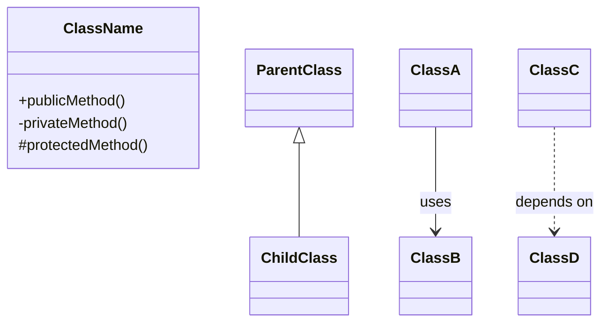
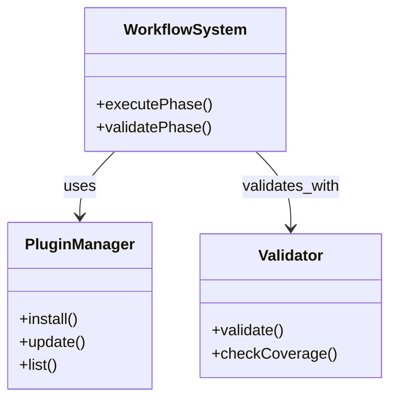

# Code Analysis - Mermaid Diagram Generator

Analyze currently loaded files and generate Mermaid.js classDiagram showing:
1. Class/Module structure
2. Inheritance relationships
3. Dependencies between components

## Instructions

**CRITICAL**: Output ONLY the Mermaid code block. No explanations, no descriptions, no text before or after.

### Analysis Steps

1. **Identify Components**:
   - Classes, modules, functions
   - Configuration files (JSON, YAML)
   - Script files (Python, Bash, JavaScript)
   - Documentation structure

2. **Extract Relationships**:
   - Inheritance: `Parent <|-- Child`
   - Composition: `Whole *-- Part`
   - Aggregation: `Container o-- Item`
   - Association: `ClassA --> ClassB`
   - Dependency: `ClassA ..> ClassB`
   - Implementation: `Interface <|.. ConcreteClass`

3. **Generate Diagram**:
   - Use proper Mermaid classDiagram syntax
   - Include class names and key methods
   - Show relationship types accurately
   - Keep diagram focused and readable

### Output Format



## Example Output (REFERENCE ONLY - DO NOT INCLUDE IN ACTUAL OUTPUT)

When user asks "현재 로드된 파일들의 클래스 상속 관계와 주요 의존성을 분석해", output:



## Rules

1. **NO TEXT OUTSIDE CODE BLOCK**: Only output the ```mermaid ... ``` block
2. **NO EXPLANATIONS**: No "Here's the diagram" or "This shows..."
3. **NO MARKDOWN FORMATTING**: No headers, lists, or paragraphs
4. **ACCURATE RELATIONSHIPS**: Use correct Mermaid syntax for relationship types
5. **FOCUSED SCOPE**: Include only essential classes/modules (max 10-15 nodes)
6. **CLEAR NAMING**: Use descriptive class/module names

## Anti-Patterns (DO NOT DO THIS)

❌ "Here's the Mermaid diagram showing..."
❌ "The following classDiagram represents..."
❌ Adding explanatory text before/after diagram
❌ Using incorrect Mermaid syntax
❌ Including too many nodes (>20)

## Success Criteria

✅ Output starts with exactly: ```mermaid
✅ Output ends with exactly: ```
✅ No text before opening ```
✅ No text after closing ```
✅ Valid Mermaid classDiagram syntax
✅ Relationships accurately reflect code structure

---

**Usage**: `/analyze-code` - Generates pure Mermaid classDiagram from loaded context
