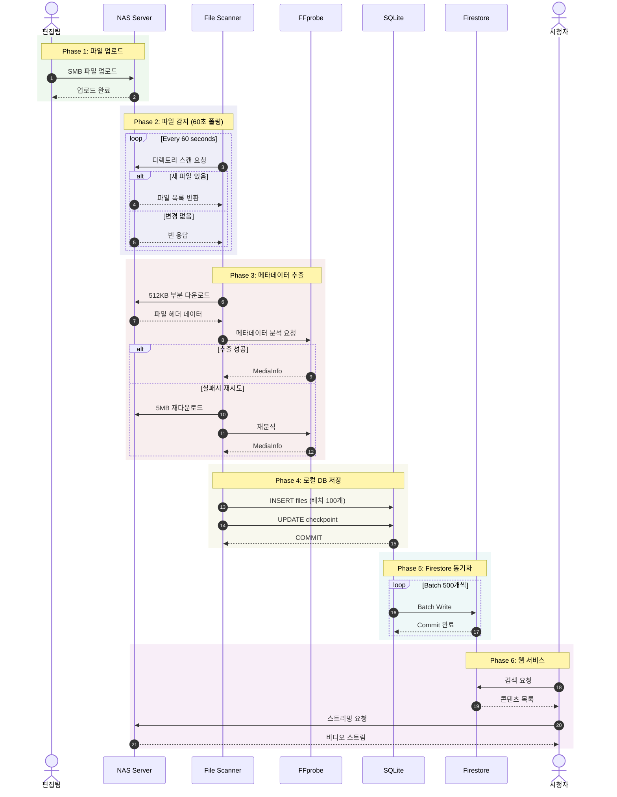

# Data Flow Documentation

> **Version**: 1.0.0
> **Updated**: 2025-12-04
> **Related Issues**: #64, #66

NAS Storage에 미디어 파일이 추가될 때 발생하는 전체 데이터 플로우를 정의합니다.

---

## 1. 시스템 개요

### 1.1 아키텍처

```
┌─────────────────────────────────────────────────────────────────────────┐
│                        Archive Analyzer System                          │
├─────────────────────────────────────────────────────────────────────────┤
│                                                                         │
│  ┌─────────────┐    ┌─────────────┐    ┌─────────────┐    ┌──────────┐ │
│  │    NAS      │    │   Scanner   │    │   SQLite    │    │ Firestore│ │
│  │  (Storage)  │───→│  (Polling)  │───→│  (Local)    │───→│ (Cloud)  │ │
│  │  18TB       │    │  watchdog   │    │ pokervod.db │    │ gg-poker │ │
│  └─────────────┘    └─────────────┘    └─────────────┘    └──────────┘ │
│        │                  │                  │                  │       │
│        │                  ▼                  │                  │       │
│        │           ┌─────────────┐           │                  │       │
│        └──────────→│  FFprobe    │───────────┘                  │       │
│         512KB      │ (Metadata)  │                              │       │
│                    └─────────────┘                              │       │
│                                                                 ▼       │
│                                                          ┌──────────┐   │
│                                                          │  Web App │   │
│                                                          │  (OTT)   │   │
│                                                          └──────────┘   │
└─────────────────────────────────────────────────────────────────────────┘
```

### 1.2 주요 컴포넌트

| 컴포넌트 | 역할 | 기술 스택 |
|----------|------|-----------|
| **NAS** | 미디어 파일 저장소 | Synology DSM, SMB3 |
| **Scanner** | 파일 변경 감지 | watchdog PollingObserver |
| **FFprobe** | 메타데이터 추출 | FFmpeg Suite |
| **SQLite** | 로컬 데이터베이스 | pokervod.db (WAL 모드) |
| **Firestore** | 클라우드 데이터베이스 | Firebase gg-poker-prod |
| **Scheduler** | 작업 스케줄링 | Huey + Redis |

---

## 2. 데이터 플로우 다이어그램

### 2.1 전체 플로우 (Mermaid Sequence Diagram)



### 2.2 단순화된 플로우

```
[편집팀]
    │
    │ SMB 업로드
    ▼
┌─────────┐     60초 폴링      ┌─────────┐
│   NAS   │ ◄───────────────── │ Scanner │
└────┬────┘                    └────┬────┘
     │                              │
     │ 512KB 다운로드               │
     ▼                              ▼
┌─────────┐                   ┌─────────┐
│ FFprobe │ ─────────────────►│ SQLite  │
└─────────┘   MediaInfo       └────┬────┘
                                   │
                                   │ Batch 500
                                   ▼
                              ┌─────────┐
                              │Firestore│
                              └────┬────┘
                                   │
                                   ▼
                              [시청자 앱]
```

---

## 3. 프로토콜별 상세 설명

### 3.1 Phase 1: 파일 업로드 (SMB/CIFS)

| 항목 | 설정 |
|------|------|
| **프로토콜** | SMB3 (권장) |
| **포트** | 445 |
| **인증** | NTLM (IP 직접 접속) |
| **서버** | 10.10.100.122 |
| **공유** | GGPNAs/ARCHIVE |

**Synology DSM 최적화 설정:**
```
Control Panel > File Services > SMB:
✓ SMB Protocol: SMB3
✓ SMB Multichannel: Enable (2x 1GbE = 1.8Gbps)
✓ Opportunistic Locking: Enable
```

---

### 3.2 Phase 2: 파일 감지 (Polling)

**왜 Polling인가?**
- SMB CHANGE_NOTIFY는 불안정 (버퍼 오버플로우, 이벤트 손실)
- Microsoft Azure Files도 Polling 방식 사용
- watchdog PollingObserver가 가장 안정적

**구현:**
```python
from watchdog.observers.polling import PollingObserver

observer = PollingObserver(timeout=60)  # 60초 간격
observer.schedule(handler, "/mnt/nas/ARCHIVE", recursive=True)
observer.start()
```

---

### 3.3 Phase 3: 메타데이터 추출 (FFprobe)

**부분 다운로드 전략:**

| 단계 | 다운로드 | probesize | 성공률 |
|------|----------|-----------|--------|
| 1차 | 앞 512KB | 524288 | 70% |
| 2차 | 앞 5MB | 5000000 | 85% |
| 3차 | 뒤 1MB (moov) | - | 95% |
| 4차 | 전체 파일 | - | 99% |

**FFprobe 명령어:**
```bash
ffprobe -probesize 524288 -analyzeduration 10000000 \
  -v quiet -print_format json \
  -show_format -show_streams input.mp4
```

**추출 필드:**

| 필드 | 설명 | 예시 |
|------|------|------|
| `codec_name` | 비디오 코덱 | h264, hevc |
| `width` × `height` | 해상도 | 1920 × 1080 |
| `duration` | 재생 시간 (초) | 3600.5 |
| `bit_rate` | 비트레이트 | 8000000 |
| `audio_codec` | 오디오 코덱 | aac |

---

### 3.4 Phase 4: 로컬 저장 (SQLite)

**배치 처리:**
```python
BATCH_SIZE = 100

with db.transaction():
    db.insert_files_batch(batch)      # 100개씩
    db.update_checkpoint(last_path)   # 진행 상태 저장
```

**체크포인트 테이블:**
```sql
scan_checkpoints (
    scan_id TEXT PRIMARY KEY,
    last_path TEXT,
    processed_files INTEGER,
    status TEXT  -- in_progress | completed
)
```

---

### 3.5 Phase 5: 클라우드 동기화 (Firestore)

**증분 동기화:**
```python
# 마지막 동기화 이후 변경된 레코드만
changed = SELECT * FROM files WHERE updated_at > last_sync

# 500개씩 Batch Write
for batch in chunks(changed, 500):
    firestore.batch().set(batch).commit()
```

**Firestore 컬렉션:**
```
firestore/
├── catalogs/{id}       # WSOP, HCL, PAD...
│   └── series/{id}     # WSOP 2024...
│       └── contents/{id}
├── files/{id}
├── players/{id}
└── _sync_metadata/
```

---

## 4. 모듈 인터페이스

### 4.1 SMBConnector

```python
class SMBConnector:
    def connect(self) -> bool
    def list_directory(path, recursive=False) -> Iterator[FileInfo]
    def read_partial(path, size=512*1024) -> bytes
    def reconnect() -> bool
```

### 4.2 ArchiveScanner

```python
class ArchiveScanner:
    def scan(resume=False) -> ScanResult
    def incremental_scan(since: datetime) -> ScanResult
    def get_checkpoint() -> Optional[Checkpoint]
```

### 4.3 FFprobeExtractor

```python
class FFprobeExtractor:
    def extract(file_path) -> MediaInfo
    def extract_from_bytes(data: bytes) -> MediaInfo
```

### 4.4 FirestoreMigrator

```python
class FirestoreMigrator:
    def migrate_all() -> MigrationResult
    def migrate_incremental() -> MigrationResult
```

---

## 5. 에러 처리

| 에러 | 원인 | 대응 |
|------|------|------|
| `SMBConnectionError` | 네트워크 끊김 | 재연결 (최대 3회) |
| `PartialFileError` | moov atom 미발견 | probesize 증가 |
| `TimeoutError` | 네트워크 지연 | 재시도 |
| `InvalidDataError` | 손상된 파일 | 스킵 |

**재시도 전략:**
```python
def retry_with_backoff(func, max_retries=3):
    for attempt in range(max_retries):
        try:
            return func()
        except Exception:
            delay = 2 ** attempt  # 1s, 2s, 4s
            time.sleep(delay)
```

---

## 6. 성능 최적화

| 지표 | 현재 | 최적화 후 |
|------|------|----------|
| 메타데이터 추출 | 2초/파일 | 1초/파일 |
| 성공률 | 70% | 95% |
| 네트워크 전송 | 5MB/파일 | 512KB/파일 |

**최적화 적용:**
- stdin pipe (임시파일 제거) → 50% 속도 향상
- probesize 512KB → 네트워크 90% 감소
- SMB3 Multichannel → 대역폭 2배

---

## 변경 이력

| 버전 | 날짜 | 변경 내용 |
|------|------|----------|
| 1.0.0 | 2025-12-04 | 초기 버전 (Issue #66) |
