# 아카이브 폴더 구조 다이어그램

> 생성일: 2025-11-27
> 총 용량: 18.03 TB | 총 파일: 1,418개

---

## 1. 전체 구조 (Mindmap)

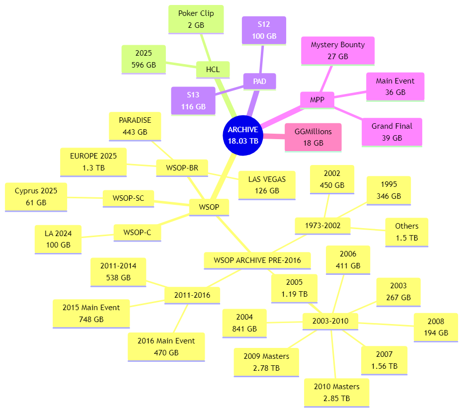

Mermaid 코드 보기

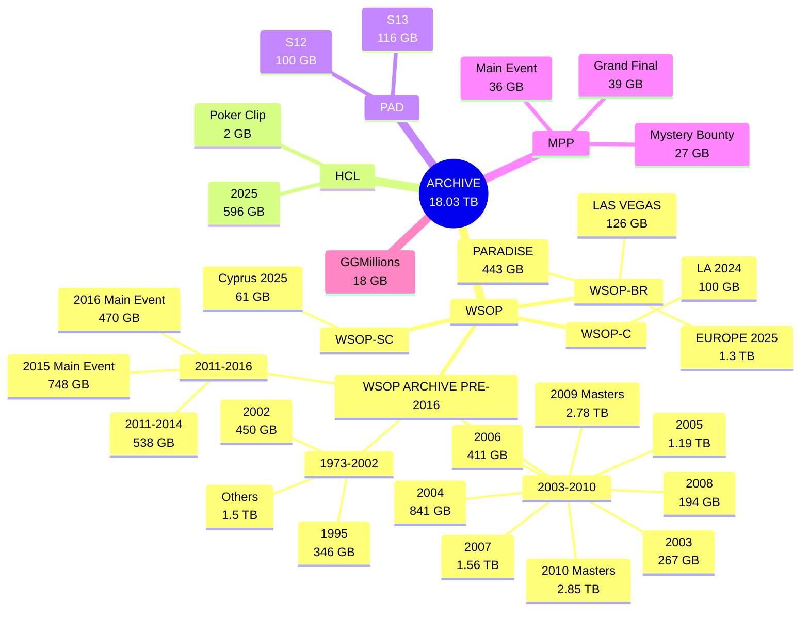

---

## 2. 용량 분포 (Pie Chart)

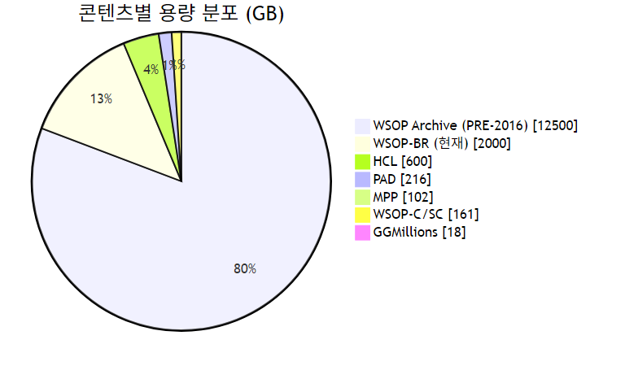

Mermaid 코드 보기

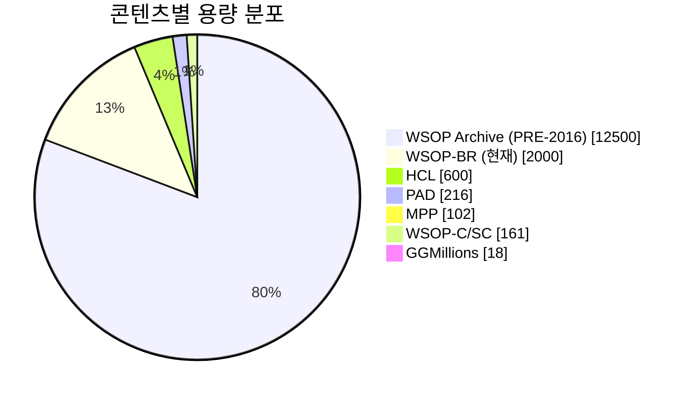

---

## 3. 파일 확장자 분포

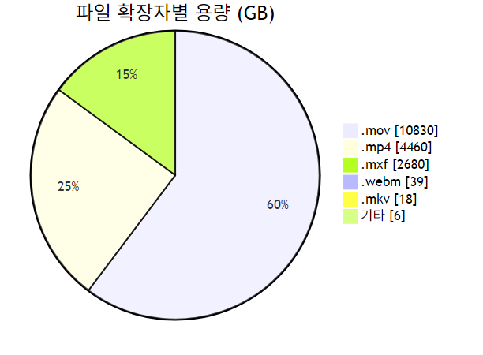

Mermaid 코드 보기

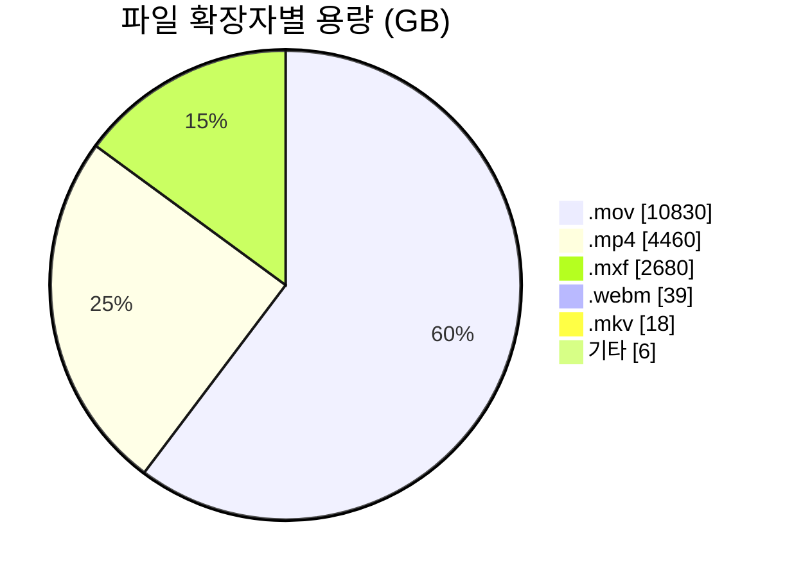

---

## 4. 상세 폴더 구조 (Flowchart)

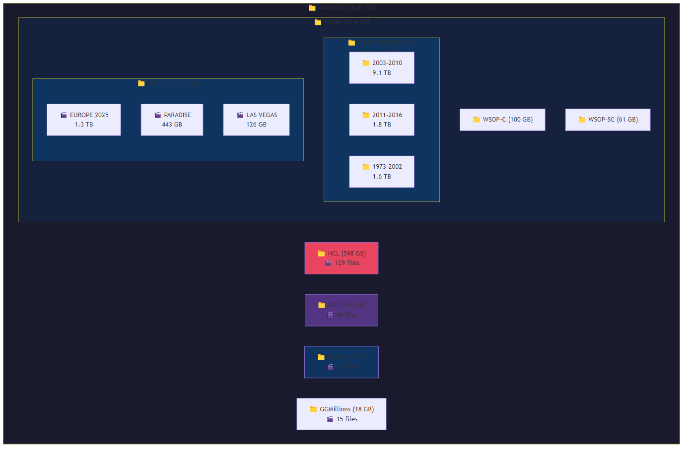

Mermaid 코드 보기

```mermaid
flowchart TD
    subgraph ARCHIVE["📁 ARCHIVE (18.03 TB)"]
        subgraph WSOP["📁 WSOP (15.6 TB)"]
            subgraph PRE2016["📁 WSOP ARCHIVE PRE-2016 (12.5 TB)"]
                Y2003_2010["📁 2003-2010<br/>9.1 TB"]
                Y2011_2016["📁 2011-2016<br/>1.8 TB"]
                Y1973_2002["📁 1973-2002<br/>1.6 TB"]
            end
            subgraph WSOP_BR["📁 WSOP-BR (2.0 TB)"]
                EUROPE["🎬 EUROPE 2025<br/>1.3 TB"]
                PARADISE["🎬 PARADISE<br/>443 GB"]
                LASVEGAS["🎬 LAS VEGAS<br/>126 GB"]
            end
            WSOP_C["📁 WSOP-C (100 GB)"]
            WSOP_SC["📁 WSOP-SC (61 GB)"]
        end

        HCL["📁 HCL (598 GB)<br/>🎬 129 files"]
        PAD["📁 PAD (216 GB)<br/>🎬 44 files"]
        MPP["📁 MPP (102 GB)<br/>🎬 11 files"]
        GGMillions["📁 GGMillions (18 GB)<br/>🎬 15 files"]
    end

    style ARCHIVE fill:#1a1a2e
    style WSOP fill:#16213e
    style PRE2016 fill:#0f3460
    style WSOP_BR fill:#0f3460
    style HCL fill:#e94560
    style PAD fill:#533483
    style MPP fill:#0f3460
```

---

## 5. 파일 유형별 상세

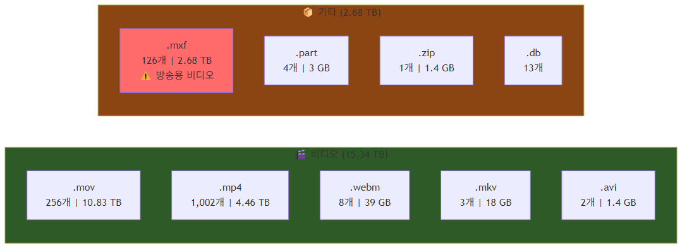

Mermaid 코드 보기

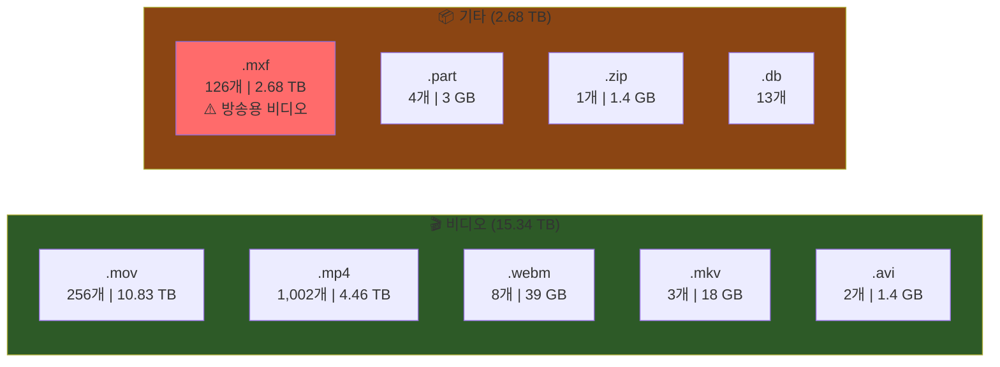

---

## 6. 주요 폴더 용량 순위 (Top 10)

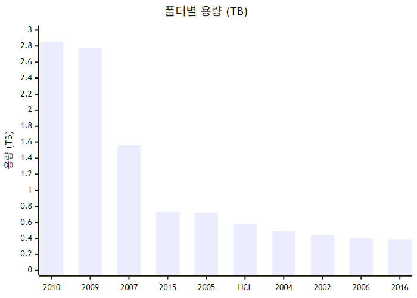

Mermaid 코드 보기

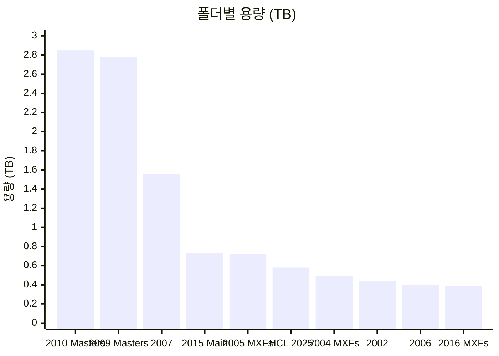

---

## 요약

| 항목 | 값 |
|------|-----|
| 총 파일 수 | 1,418개 |
| 총 용량 | 18.03 TB |
| 비디오 파일 | 1,271개 (15.34 TB) |
| 주요 확장자 | .mov (60%), .mp4 (25%), .mxf (15%) |
| 최대 폴더 | WSOP 2010 Masters (2.85 TB) |

> **참고**: .mxf 파일은 프로페셔널 방송용 비디오 포맷으로, video 유형으로 재분류 권장

---

## 이미지 파일 목록

| 파일명 | 설명 |
|--------|------|
| `diagrams/01_mindmap.png` | 전체 폴더 구조 마인드맵 |
| `diagrams/02_pie_content.png` | 콘텐츠별 용량 분포 |
| `diagrams/03_pie_extension.png` | 파일 확장자별 용량 분포 |
| `diagrams/04_flowchart.png` | 상세 폴더 구조 플로우차트 |
| `diagrams/05_filetype.png` | 파일 유형별 상세 |
| `diagrams/06_bar_chart.png` | 폴더 용량 순위 차트 |
