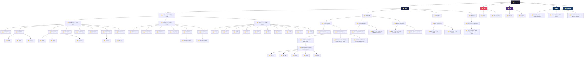

# 아카이브 폴더 구조

> 생성일: 2025-11-27
> 스타일: Windows 탐색기 트리 형태

---

## 폴더 구조 다이어그램



---

## 텍스트 트리 구조 (확장자별 파일 수 / 용량)

```
📁 ARCHIVE/
│
├── 📁 WSOP/
│   │
│   ├── 📁 WSOP ARCHIVE (PRE-2016)/
│   │   │
│   │   ├── 📁 WSOP Archive (2003-2010)/
│   │   │   ├── 📁 WSOP 2003 ────────── mxf: 12개 (237GB) | mov: 5개 (30GB)
│   │   │   ├── 📁 WSOP 2004 ────────── mxf: 23개 (501GB) | mov: 32개 (340GB)
│   │   │   ├── 📁 WSOP 2005 ────────── mxf: 32개 (736GB) | mov: 43개 (455GB)
│   │   │   ├── 📁 WSOP 2006 ────────── mov: 31개 (407GB) | mxf: 2개 (45GB)
│   │   │   ├── 📁 WSOP 2007 ────────── mov: 32개 (1.6TB) | mxf: 2개 (41GB)
│   │   │   ├── 📁 WSOP 2008 ────────── mp4: 31개 (119GB) | mxf: 1개 (41GB)
│   │   │   ├── 📁 WSOP 2009 ────────── mov: 32개 (2.8TB) | mxf: 2개 (43GB)
│   │   │   └── 📁 WSOP 2010 ────────── mov: 33개 (2.9TB) | mxf: 2개 (42GB)
│   │   │
│   │   ├── 📁 WSOP Archive (2011-2016)/
│   │   │   ├── 📁 WSOP 2011 ────────── mp4: 32개 (105GB) | mxf: 2개 (39GB)
│   │   │   ├── 📁 WSOP 2012 ────────── mp4: 28개 (92GB)  | mxf: 2개 (41GB)
│   │   │   ├── 📁 WSOP 2013 ────────── mp4: 28개 (92GB)  | mxf: 2개 (40GB)
│   │   │   ├── 📁 WSOP 2014 ────────── mp4: 28개 (87GB)  | mxf: 2개 (41GB)
│   │   │   ├── 📁 WSOP 2015 ────────── mov: 21개 (818GB) | mp4: 2개 (7GB)
│   │   │   └── 📁 WSOP 2016 ────────── mxf: 18개 (440GB) | mp4: 18개 (71GB)
│   │   │
│   │   └── 📁 WSOP Archive (1973-2002)/
│   │       ├── 📁 1973-1979 ─────────── mp4: 8개 (30GB)   | avi: 2개 (1GB)
│   │       ├── 📁 1981-1989 ─────────── mov: 8개 (493GB)  | mxf: 10개 (185GB)
│   │       ├── 📁 1990-1999 ─────────── mov: 10개 (854GB) | mxf: 8개 (179GB)
│   │       └── 📁 2000-2002 ─────────── mov: 4개 (375GB)  | mxf: 6개 (91GB)
│   │
│   ├── 📁 WSOP-BR/
│   │   │
│   │   ├── 📁 WSOP-EUROPE/
│   │   │   ├── 📁 2024 WSOP-Europe ─── mp4: 30개 (71GB)
│   │   │   └── 📁 2025 WSOP-Europe ─── mp4: 42개 (1.8TB)
│   │   │
│   │   ├── 📁 WSOP-PARADISE/
│   │   │   ├── 📁 2023 WSOP-PARADISE ─ mp4: 49개 (76GB)
│   │   │   └── 📁 2024 WSOP-PARADISE ─ mp4: 279개 (347GB)
│   │   │
│   │   └── 📁 WSOP-LAS VEGAS/
│   │       ├── 📁 2024 (PokerGo Clip)  mp4: 98개 (55GB)
│   │       └── 📁 2025 WSOP-LAS VEGAS  mp4: 59개 (395GB)
│   │
│   ├── 📁 WSOP-C/
│   │   └── 📁 2024 WSOP-C LA ───────── mp4: 40개 (100GB)
│   │
│   └── 📁 WSOP-SC/
│       └── 📁 2025 WSOP-SC (Cyprus) ── mp4: 6개 (61GB)
│
├── 📁 HCL/
│   ├── 📁 2025 ──────────────────────── mp4: 106개 (536GB) | webm: 8개 (39GB) | mkv: 3개 (18GB)
│   └── 📁 HCL Poker Clip ───────────── mp4: 8개 (2GB)
│
├── 📁 PAD/
│   ├── 📁 PAD S12 ───────────────────── mp4: 21개 (100GB)
│   └── 📁 PAD S13 ───────────────────── mp4: 23개 (116GB)
│
├── 📁 MPP/
│   ├── 📁 $2M GTD Grand Final ──────── mp4: 3개 (39GB)
│   ├── 📁 $5M GTD Main Event ───────── mp4: 4개 (36GB)
│   └── 📁 $1M GTD Mystery Bounty ──── mp4: 4개 (27GB)
│
└── 📁 GGMillions/ ───────────────────── mp4: 15개 (18GB)
```

---

## 요약 통계

| 카테고리 | 폴더 수 | 파일 수 | 총 용량 |
|---------|--------|--------|--------|
| **WSOP PRE-2016** | 22 | ~400 | ~13TB |
| **WSOP-BR** | 6 | ~560 | ~3TB |
| **WSOP-C/SC** | 2 | 46 | 161GB |
| **HCL** | 2 | 125 | 595GB |
| **PAD** | 2 | 44 | 216GB |
| **MPP** | 3 | 11 | 102GB |
| **GGMillions** | 1 | 15 | 18GB |

---

## 주요 확장자

| 확장자 | 용도 | 평균 파일 크기 |
|-------|------|--------------|
| `.mxf` | 방송용 마스터 파일 | 20-40GB |
| `.mov` | ProRes/편집용 | 50-90GB |
| `.mp4` | 배포/스트림용 | 3-15GB |
| `.webm` | 웹 배포용 | 4-5GB |
| `.mkv` | 컨테이너 포맷 | 5-6GB |

---

## OTT 솔루션 메타데이터 태그 스키마

### 필수 태그 (Required Tags)

| 태그명 | 타입 | 설명 | 예시 |
|-------|------|------|------|
| `content_id` | string | 고유 콘텐츠 식별자 | `WSOP-2024-ME-D1-001` |
| `title` | string | 콘텐츠 제목 | `WSOP 2024 Main Event Day 1` |
| `title_ko` | string | 한글 제목 | `WSOP 2024 메인 이벤트 1일차` |
| `duration` | integer | 재생 시간 (초) | `7200` |
| `file_size` | integer | 파일 크기 (bytes) | `10737418240` |
| `created_at` | datetime | 생성 일시 (ISO 8601) | `2024-06-15T14:30:00Z` |
| `modified_at` | datetime | 수정 일시 (ISO 8601) | `2024-06-20T09:15:00Z` |

### 미디어 기술 태그 (Technical Tags)

| 태그명 | 타입 | 설명 | 예시 |
|-------|------|------|------|
| `video_codec` | string | 비디오 코덱 | `h264`, `hevc`, `prores` |
| `audio_codec` | string | 오디오 코덱 | `aac`, `pcm`, `ac3` |
| `container` | string | 컨테이너 포맷 | `mp4`, `mov`, `mxf` |
| `resolution` | string | 해상도 | `1920x1080`, `3840x2160` |
| `resolution_label` | string | 해상도 라벨 | `HD`, `FHD`, `4K`, `SD` |
| `frame_rate` | float | 프레임레이트 | `29.97`, `59.94`, `25.0` |
| `bitrate_video` | integer | 비디오 비트레이트 (kbps) | `50000` |
| `bitrate_audio` | integer | 오디오 비트레이트 (kbps) | `320` |
| `aspect_ratio` | string | 화면 비율 | `16:9`, `4:3` |
| `color_space` | string | 색공간 | `bt709`, `bt2020` |
| `hdr_format` | string | HDR 포맷 | `SDR`, `HDR10`, `HLG` |
| `audio_channels` | integer | 오디오 채널 수 | `2`, `6` |
| `audio_sample_rate` | integer | 샘플레이트 (Hz) | `48000` |

### 콘텐츠 분류 태그 (Classification Tags)

| 태그명 | 타입 | 설명 | 예시 |
|-------|------|------|------|
| `brand` | string | 브랜드/시리즈 | `WSOP`, `HCL`, `PAD`, `MPP` |
| `sub_brand` | string | 서브 브랜드 | `WSOP-EUROPE`, `WSOP-PARADISE` |
| `event_type` | string | 이벤트 유형 | `Main Event`, `Side Event`, `Final Table` |
| `event_name` | string | 이벤트명 | `$10K No-Limit Hold'em Championship` |
| `tournament_year` | integer | 대회 연도 | `2024` |
| `season` | string | 시즌 | `S12`, `S13` |
| `episode` | integer | 에피소드 번호 | `1`, `15` |
| `day` | string | 대회 일차 | `Day 1A`, `Day 2`, `Final Table` |
| `location` | string | 개최 장소 | `Las Vegas`, `Rozvadov`, `Paradise Island` |
| `country` | string | 국가 코드 (ISO 3166-1) | `US`, `CZ`, `BS` |

### 배포/스트리밍 태그 (Distribution Tags)

| 태그명 | 타입 | 설명 | 예시 |
|-------|------|------|------|
| `content_type` | string | 콘텐츠 유형 | `full`, `highlight`, `clip`, `trailer` |
| `version` | string | 버전 구분 | `master`, `broadcast`, `stream`, `archive` |
| `language` | string | 언어 코드 (ISO 639-1) | `en`, `ko` |
| `audio_track` | string | 오디오 트랙 유형 | `commentary`, `no_commentary`, `international` |
| `has_graphics` | boolean | 그래픽 포함 여부 | `true`, `false` |
| `is_live` | boolean | 라이브 녹화 여부 | `true` |
| `drm_required` | boolean | DRM 필요 여부 | `true` |
| `geo_restriction` | array | 지역 제한 코드 | `["US", "KR"]` |
| `age_rating` | string | 연령 등급 | `ALL`, `12+`, `15+`, `18+` |

### 검색/탐색 태그 (Discovery Tags)

| 태그명 | 타입 | 설명 | 예시 |
|-------|------|------|------|
| `tags` | array | 검색 태그 | `["poker", "texas holdem", "tournament"]` |
| `players` | array | 출연 선수 | `["Phil Hellmuth", "Daniel Negreanu"]` |
| `description` | string | 콘텐츠 설명 | `WSOP 2024 메인 이벤트 1일차...` |
| `thumbnail_url` | string | 썸네일 URL | `/thumbnails/wsop-2024-me-d1.jpg` |
| `preview_url` | string | 프리뷰 영상 URL | `/previews/wsop-2024-me-d1.mp4` |

### 관리/운영 태그 (Management Tags)

| 태그명 | 타입 | 설명 | 예시 |
|-------|------|------|------|
| `source_path` | string | 원본 파일 경로 | `\\NAS\ARCHIVE\WSOP\...` |
| `checksum_md5` | string | MD5 체크섬 | `d41d8cd98f00b204e9800998ecf8427e` |
| `scan_status` | string | 스캔 상태 | `pending`, `completed`, `error` |
| `transcode_status` | string | 트랜스코딩 상태 | `pending`, `processing`, `completed` |
| `publish_status` | string | 게시 상태 | `draft`, `scheduled`, `published`, `archived` |
| `publish_date` | datetime | 게시 예정일 | `2024-07-01T00:00:00Z` |
| `expire_date` | datetime | 만료일 | `2025-12-31T23:59:59Z` |

---

## 메타데이터 JSON 스키마 예시

```json
{
  "content_id": "WSOP-2024-ME-D1A-001",
  "title": "WSOP 2024 Main Event Day 1A",
  "title_ko": "WSOP 2024 메인 이벤트 1A일차",
  "duration": 28800,
  "file_size": 17851180236,

  "technical": {
    "video_codec": "h264",
    "audio_codec": "aac",
    "container": "mp4",
    "resolution": "1920x1080",
    "resolution_label": "FHD",
    "frame_rate": 29.97,
    "bitrate_video": 45000,
    "bitrate_audio": 320,
    "aspect_ratio": "16:9",
    "color_space": "bt709",
    "hdr_format": "SDR",
    "audio_channels": 2,
    "audio_sample_rate": 48000
  },

  "classification": {
    "brand": "WSOP",
    "sub_brand": "WSOP-LAS VEGAS",
    "event_type": "Main Event",
    "event_name": "$10K No-Limit Hold'em World Championship",
    "tournament_year": 2024,
    "day": "Day 1A",
    "location": "Las Vegas",
    "country": "US"
  },

  "distribution": {
    "content_type": "full",
    "version": "stream",
    "language": "en",
    "audio_track": "commentary",
    "has_graphics": true,
    "is_live": true,
    "drm_required": true,
    "geo_restriction": [],
    "age_rating": "ALL"
  },

  "discovery": {
    "tags": ["poker", "wsop", "main event", "texas holdem", "tournament", "2024"],
    "players": ["Jonathan Tamayo", "Jordan Griff", "Niklas Astedt"],
    "description": "WSOP 2024 메인 이벤트 1A일차 풀 영상. 세계 최대 포커 토너먼트의 첫날 액션.",
    "thumbnail_url": "/thumbnails/wsop-2024-me-d1a.jpg",
    "preview_url": "/previews/wsop-2024-me-d1a-preview.mp4"
  },

  "management": {
    "source_path": "\\\\NAS\\ARCHIVE\\WSOP\\WSOP-BR\\WSOP-LAS VEGAS\\2024 WSOP-LAS VEGAS",
    "checksum_md5": "a1b2c3d4e5f6g7h8i9j0k1l2m3n4o5p6",
    "scan_status": "completed",
    "transcode_status": "completed",
    "publish_status": "published",
    "created_at": "2024-06-15T14:30:00Z",
    "modified_at": "2024-06-20T09:15:00Z",
    "publish_date": "2024-06-16T00:00:00Z",
    "expire_date": null
  }
}
```

---

## 브랜드별 태그 매핑 규칙

### WSOP 시리즈

| 폴더 패턴 | brand | sub_brand | event_type |
|----------|-------|-----------|------------|
| `WSOP-LAS VEGAS` | WSOP | WSOP-LAS VEGAS | Main Event / Side Event |
| `WSOP-EUROPE` | WSOP | WSOP-EUROPE | Main Event / Side Event |
| `WSOP-PARADISE` | WSOP | WSOP-PARADISE | Super Main Event |
| `WSOP-C` | WSOP | WSOP-Circuit | Circuit Event |
| `WSOP-SC` | WSOP | WSOP-Super Circuit | Super Circuit |
| `PRE-2016` | WSOP | WSOP-Archive | Archive |

### HCL (Hustler Casino Live)

| 폴더 패턴 | brand | content_type |
|----------|-------|--------------|
| `HCL/2025` | HCL | full |
| `HCL Poker Clip` | HCL | clip |

### PAD (Poker After Dark)

| 폴더 패턴 | brand | season |
|----------|-------|--------|
| `PAD S12` | PAD | S12 |
| `PAD S13` | PAD | S13 |

### MPP (MILLIONS Poker Party)

| 폴더 패턴 | brand | event_name |
|----------|-------|------------|
| `$2M GTD Grand Final` | MPP | Grand Final |
| `$5M GTD Main Event` | MPP | Main Event |
| `$1M GTD Mystery Bounty` | MPP | Mystery Bounty |

---

## 파일명 파싱 규칙

### 패턴 1: WSOP 메인 이벤트
```
WSOP {year} Main Event _ Day {day}
→ tournament_year: {year}, event_type: "Main Event", day: "Day {day}"
```

### 패턴 2: WSOP 사이드 이벤트
```
WSOP {year} Bracelet Events _ Event #{num} ${buyin} {game_type}
→ event_type: "Side Event", event_name: "${buyin} {game_type}"
```

### 패턴 3: HCL 에피소드
```
HCL {date} {title}
→ brand: "HCL", episode: auto-increment
```

### 패턴 4: PAD 시즌 에피소드
```
PAD S{season} EP{episode}
→ brand: "PAD", season: "S{season}", episode: {episode}
```
