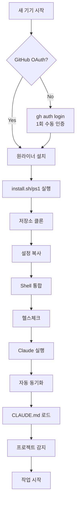

두 문서를 통합하여 **최종 완벽한 Claude Code 자동화 설계**를 제시하겠습니다.

# 🚀 Claude Code Universal Configuration - 최종 완벽 설계

## 📋 핵심 설계 원칙

### 1. **변하지 않는 진실 (SSOT)**
- GitHub 저장소 `claude-code-config`가 모든 장비의 단일 진실 원천
- OAuth 인증은 계정 레벨에서 1회만 (보안 원칙)
- 전역 설정 → 프로젝트 설정 → 하위 폴더 설정 순으로 계층적 적용

### 2. **최소 수동 개입**
- GitHub OAuth 인증 (1회)
- 원라이너 설치 스크립트 실행 (1회)
- 이후 모든 것은 자동화

## 🏗️ 완벽한 저장소 구조

```
claude-code-config/                 # SSOT (Single Source of Truth)
├── .claude/                        # Claude Code 직접 읽기 디렉토리
│   ├── claude.md                   # 전역 메인 지시사항 (자동 로드)
│   ├── version.json                # {"version": "2.0.0", "schema": "2024-12"}
│   ├── settings/                   # 추가 설정
│   │   ├── tools.md               # MCP 도구 설정
│   │   └── behaviors.md           # 동작 규칙
│   └── migrations/                 # 버전 마이그레이션
│       └── migrate-1.x-to-2.x.sh
├── templates/                      # 언어별 템플릿
│   ├── python/
│   │   ├── CLAUDE.md
│   │   └── .devcontainer/
│   ├── javascript/
│   │   ├── CLAUDE.md
│   │   └── .devcontainer/
│   └── rust/
│       ├── CLAUDE.md
│       └── .devcontainer/
├── scripts/
│   ├── install.sh                 # macOS/Linux/WSL
│   ├── install.ps1                # Windows PowerShell
│   ├── update.sh                  # 수동 업데이트
│   ├── healthcheck.sh             # 시스템 진단
│   ├── uninstall.sh              # 제거/복구
│   └── wrapper.sh                # Claude 실행 래퍼
├── .devcontainer/                 # 표준 개발 컨테이너
│   └── devcontainer.json
├── .github/
│   └── workflows/
│       ├── ci.yml                # 설정 검증 CI
│       └── sync.yml              # 자동 동기화
├── Makefile                      # 표준 명령어
└── README.md                     # 설치/운영 가이드
```

## 📝 최종 CLAUDE.md (전역 메인)

```markdown
# 🎯 Claude Code Universal Configuration v2.0
> 이 파일은 Claude Code가 자동으로 로드하며, 모든 작업의 기준이 됩니다.

## ⚡ INITIALIZATION PROTOCOL [자동 실행]
> 모든 세션 시작 시 아래 체크리스트를 순서대로 실행하고 결과를 보고하세요.

### Phase 1: 환경 검증
```bash
# 1. GitHub 연동 상태 확인
if command -v gh &> /dev/null; then
    gh auth status 2>/dev/null || echo "⚠️ GitHub 미연동 - Settings > Integrations 필요"
else
    echo "⚠️ GitHub CLI 미설치 - OAuth 웹 인증 필요"
fi

# 2. 설정 저장소 존재 확인
if [ ! -d ~/.claude-config ]; then
    echo "🔄 초기 설정 다운로드 중..."
    git clone --depth=1 https://github.com/[username]/claude-code-config.git ~/.claude-config
    rsync -a ~/.claude-config/.claude/ ~/.claude/
fi

# 3. 버전 확인 및 마이그레이션
LOCAL_VERSION=$(cat ~/.claude/version.json | jq -r .version 2>/dev/null || echo "0.0.0")
REMOTE_VERSION=$(curl -s https://api.github.com/repos/[username]/claude-code-config/contents/version.json | jq -r .content | base64 -d | jq -r .version)

if [ "$LOCAL_VERSION" != "$REMOTE_VERSION" ]; then
    echo "🔄 버전 업데이트 필요: $LOCAL_VERSION → $REMOTE_VERSION"
    cd ~/.claude-config && git pull --ff-only
    rsync -a ~/.claude-config/.claude/ ~/.claude/
    
    # 마이그레이션 실행
    if [ -f ~/.claude/migrations/migrate-${LOCAL_VERSION}-to-${REMOTE_VERSION}.sh ]; then
        bash ~/.claude/migrations/migrate-${LOCAL_VERSION}-to-${REMOTE_VERSION}.sh
    fi
fi
```

### Phase 2: 프로젝트 타입 감지 및 설정 적용
```bash
# 프로젝트 타입 자동 감지 및 템플릿 적용
detect_and_apply_project_config() {
    local project_type=""
    
    # Node.js/JavaScript
    if [ -f package.json ]; then
        project_type="javascript"
        echo "📦 Node.js project detected"
    # Python
    elif [ -f requirements.txt ] || [ -f pyproject.toml ] || [ -f Pipfile ]; then
        project_type="python"
        echo "🐍 Python project detected"
    # Rust
    elif [ -f Cargo.toml ]; then
        project_type="rust"
        echo "🦀 Rust project detected"
    # Go
    elif [ -f go.mod ]; then
        project_type="go"
        echo "🐹 Go project detected"
    fi
    
    # 템플릿 적용 (프로젝트별 CLAUDE.md 오버레이)
    if [ -n "$project_type" ] && [ -f ~/.claude-config/templates/$project_type/CLAUDE.md ]; then
        echo "✅ Loading $project_type specific configuration"
        # 프로젝트별 설정을 컨텍스트에 추가
        cat ~/.claude-config/templates/$project_type/CLAUDE.md
    fi
    
    # 로컬 프로젝트 CLAUDE.md 확인
    if [ -f ./CLAUDE.md ]; then
        echo "📌 Project-specific CLAUDE.md found - applying overrides"
    fi
}

detect_and_apply_project_config
```

### Phase 3: 개발 환경 설정
```bash
# Dev Container 감지 및 제안
if [ -f .devcontainer/devcontainer.json ]; then
    echo "🐳 Dev Container available - 'Reopen in Container' for consistent environment"
elif command -v docker &> /dev/null; then
    echo "🐳 Docker available - consider using Dev Container for consistency"
fi

# 필수 도구 확인
check_required_tools() {
    local missing_tools=()
    
    # 기본 도구 체크
    for tool in git curl jq; do
        if ! command -v $tool &> /dev/null; then
            missing_tools+=($tool)
        fi
    done
    
    if [ ${#missing_tools[@]} -gt 0 ]; then
        echo "⚠️ Missing tools: ${missing_tools[*]}"
        echo "   Install with: [package manager] install ${missing_tools[*]}"
    fi
}

check_required_tools
```

### Phase 4: 동기화 잠금 및 상태 보고
```bash
# 동기화 잠금 확인
LOCK_FILE=~/.claude/.sync.lock
if [ -f "$LOCK_FILE" ]; then
    LOCK_AGE=$(($(date +%s) - $(stat -f %m "$LOCK_FILE" 2>/dev/null || stat -c %Y "$LOCK_FILE")))
    if [ $LOCK_AGE -gt 300 ]; then  # 5분 이상 된 잠금은 제거
        rm -f "$LOCK_FILE"
        echo "🔓 Removed stale lock file"
    fi
fi

# 최종 상태 보고
echo "
╔════════════════════════════════════════╗
║     Claude Code Environment Ready      ║
╠════════════════════════════════════════╣
║ Version: $(cat ~/.claude/version.json | jq -r .version)
║ GitHub:  $(gh auth status 2>/dev/null | grep -q "Logged in" && echo "✅ Connected" || echo "⚠️ Not connected")
║ Project: $(basename $(pwd))
║ Type:    ${project_type:-"Generic"}
║ Updated: $(date -r ~/.claude/claude.md '+%Y-%m-%d %H:%M' 2>/dev/null || date '+%Y-%m-%d %H:%M')
╚════════════════════════════════════════╝
"
```

## 🎨 UNIVERSAL STANDARDS

### Git Workflow
```yaml
commit_format: "type(scope): description"
types: [feat, fix, docs, style, refactor, test, chore, perf, build]
branch_naming:
  - feature/[ticket]-[description]
  - bugfix/[ticket]-[description]
  - hotfix/[ticket]-[description]
workflow:
  - Always pull before push
  - Rebase feature branches
  - Squash commits when merging
```

### Security Rules
```yaml
never_commit:
  - .env, .env.*
  - "*.key", "*.pem", "*.cert"
  - secrets/, credentials/
  - "*.sqlite", "*.db" (unless explicitly allowed)
api_keys: "Use environment variables only"
secrets_management: "HashiCorp Vault or cloud KMS"
```

### Code Quality
```yaml
formatting:
  - Auto-format on save
  - Use project .editorconfig
linting:
  - Fix all warnings before commit
  - Run pre-commit hooks
testing:
  - Minimum 80% coverage
  - All tests must pass before push
documentation:
  - Update README for public changes
  - Document breaking changes
  - Keep CHANGELOG.md current
```

## 🔄 CONTINUOUS OPERATIONS

### Every Session Start
1. Sync configuration: `cd ~/.claude-config && git pull --ff-only`
2. Check for migrations: `~/.claude/migrations/check.sh`
3. Validate environment: `~/.claude-config/scripts/healthcheck.sh`
4. Load project context: `find . -name "CLAUDE.md" -exec cat {} \;`

### Every File Save
- Format code if formatter configured
- Update imports/dependencies
- Check for security issues

### Every Commit
- Validate commit message format
- Run linters and tests
- Update version if needed

## 🛠️ STANDARD COMMANDS
```makefile
# Universal commands available in every project
make setup      # Initialize project environment
make test       # Run all tests with coverage
make lint       # Run linters and formatters
make build      # Build project artifacts
make deploy     # Deploy to target environment
make clean      # Clean generated files
make help       # Show all available commands
```

## 📊 CONTEXT AWARENESS

### Information Hierarchy
1. **Current directory CLAUDE.md** (most specific)
2. **Parent directories CLAUDE.md** (inherited)
3. **Project root CLAUDE.md** (project-wide)
4. **Template CLAUDE.md** (language-specific)
5. **Global ~/.claude/claude.md** (universal)

### Smart Behaviors
- **On error**: Attempt auto-fix → Explain issue → Suggest solution
- **On conflict**: Show diff → Explain implications → Ask for decision
- **On performance issue**: Profile → Identify bottleneck → Optimize
- **On security warning**: Block action → Explain risk → Provide safe alternative

## 🚫 ABSOLUTE RESTRICTIONS
```yaml
never_modify:
  - /infra/prod/*
  - /.github/workflows/prod-*
  - "*.generated.*"
  - "*.lock" (unless explicitly requested)
read_only:
  - Production databases
  - Customer data
  - Audit logs
require_confirmation:
  - Deleting > 10 files
  - Modifying > 100 lines
  - Any destructive operation
```

## 🔌 MCP (Model Context Protocol) Tools
Refer to ~/.claude/settings/tools.md for available tools:
- File system operations (with restrictions)
- GitHub integration (PRs, issues, reviews)
- Database access (read-only by default)
- External API calls (with rate limiting)
- Shell command execution (sandboxed)

## 💡 DECISION FRAMEWORK
When facing choices, prioritize in order:
1. **Security** - Never compromise
2. **Data integrity** - Protect user data
3. **Performance** - Optimize when needed
4. **Maintainability** - Write clear code
5. **Features** - Implement requested functionality

## 📈 METRICS & REPORTING
Track and report:
- Task completion time
- Code quality metrics
- Test coverage changes
- Security scan results
- Performance benchmarks

---
Last updated: $(date)
Configuration version: 2.0.0
```

## 🔧 원라이너 설치 스크립트

### macOS/Linux/WSL
```bash
# 완벽한 설치 스크립트 (install.sh)
#!/usr/bin/env bash
set -euo pipefail

# 색상 코드
RED='\033[0;31m'
GREEN='\033[0;32m'
YELLOW='\033[1;33m'
NC='\033[0m' # No Color

# 설정
REPO="https://github.com/[username]/claude-code-config.git"
CONFIG_DIR="$HOME/.claude"
BACKUP_DIR="$HOME/.claude.backup.$(date +%Y%m%d%H%M%S)"
TEMP_DIR="$(mktemp -d)"
LOCK_FILE="$CONFIG_DIR/.install.lock"

# 트랩 설정 (정리)
trap 'rm -rf "$TEMP_DIR" "$LOCK_FILE"' EXIT

# 함수들
log() { echo -e "${GREEN}✓${NC} $1"; }
warn() { echo -e "${YELLOW}⚠${NC} $1"; }
error() { echo -e "${RED}✗${NC} $1"; exit 1; }

check_command() {
    if ! command -v "$1" &> /dev/null; then
        error "$1 is required but not installed"
    fi
}

acquire_lock() {
    local count=0
    while [ -f "$LOCK_FILE" ] && [ $count -lt 30 ]; do
        warn "Another installation in progress, waiting..."
        sleep 2
        ((count++))
    done
    
    if [ $count -eq 30 ]; then
        error "Installation lock timeout"
    fi
    
    touch "$LOCK_FILE"
}

# 메인 로직
main() {
    echo "🚀 Claude Code Perfect Setup v2.0"
    echo "=================================="
    
    # 잠금 획득
    acquire_lock
    
    # 의존성 확인
    log "Checking dependencies..."
    check_command git
    check_command rsync
    
    # GitHub CLI 확인 (선택적)
    if command -v gh &> /dev/null; then
        log "GitHub CLI found"
        if ! gh auth status &> /dev/null; then
            warn "GitHub CLI not authenticated. Run: gh auth login"
        fi
    else
        warn "GitHub CLI not found. Manual GitHub integration required"
    fi
    
    # 저장소 클론
    log "Cloning configuration repository..."
    git clone --depth=1 "$REPO" "$TEMP_DIR" || error "Failed to clone repository"
    
    # 백업
    if [ -d "$CONFIG_DIR" ]; then
        log "Backing up existing configuration to $BACKUP_DIR"
        mv "$CONFIG_DIR" "$BACKUP_DIR"
    fi
    
    # 설치
    log "Installing configuration..."
    mkdir -p "$CONFIG_DIR"
    rsync -a "$TEMP_DIR/.claude/" "$CONFIG_DIR/"
    
    # 심볼릭 링크 생성 (templates)
    ln -sf "$CONFIG_DIR/../claude-config/templates" "$CONFIG_DIR/templates"
    
    # 권한 설정
    chmod 700 "$CONFIG_DIR"
    chmod 600 "$CONFIG_DIR/claude.md"
    
    # Shell 통합 설정
    setup_shell_integration() {
        local shell_rc=""
        
        if [ -n "${BASH_VERSION:-}" ]; then
            shell_rc="$HOME/.bashrc"
        elif [ -n "${ZSH_VERSION:-}" ]; then
            shell_rc="$HOME/.zshrc"
        fi
        
        if [ -n "$shell_rc" ] && [ -f "$shell_rc" ]; then
            if ! grep -q "claude-code-wrapper" "$shell_rc"; then
                log "Adding shell integration to $shell_rc"
                cat >> "$shell_rc" << 'EOF'

# Claude Code Wrapper (auto-sync)
claude() {
    # claude-code-wrapper
    local CFG="$HOME/.claude"
    local LOCK="$CFG/.sync.lock"
    
    # 빠른 동기화 체크
    if [ -d "$CFG/.git" ] || [ -d "$HOME/.claude-config/.git" ]; then
        (
            flock -n 9 || return 0
            if [ -d "$HOME/.claude-config/.git" ]; then
                git -C "$HOME/.claude-config" pull --ff-only --quiet 2>/dev/null || true
                rsync -a --quiet "$HOME/.claude-config/.claude/" "$CFG/" 2>/dev/null || true
            fi
        ) 9>"$LOCK" &
    fi
    
    command claude "$@"
}
EOF
                log "Shell integration added. Run: source $shell_rc"
            fi
        fi
    }
    
    setup_shell_integration
    
    # 헬스체크
    log "Running health check..."
    if [ -f "$TEMP_DIR/scripts/healthcheck.sh" ]; then
        bash "$TEMP_DIR/scripts/healthcheck.sh" || warn "Health check reported issues"
    fi
    
    # 완료 메시지
    echo ""
    echo "╔════════════════════════════════════════╗"
    echo "║     Installation Complete! 🎉          ║"
    echo "╠════════════════════════════════════════╣"
    echo "║ Config: $CONFIG_DIR"
    echo "║ Backup: ${BACKUP_DIR:-None}"
    echo "╚════════════════════════════════════════╝"
    echo ""
    echo "Next steps:"
    echo "1. Run: source ~/.bashrc (or ~/.zshrc)"
    echo "2. Authenticate GitHub: gh auth login"
    echo "3. Start using: claude [your command]"
    echo ""
    log "Setup complete!"
}

# 실행
main "$@"
```

### Windows PowerShell
```powershell
# install.ps1 - Windows용 완벽한 설치 스크립트
#Requires -RunAsAdministrator

[CmdletBinding()]
param()

$ErrorActionPreference = "Stop"
$ProgressPreference = "SilentlyContinue"

# 설정
$repo = "https://github.com/[username]/claude-code-config.git"
$configDir = "$HOME\.claude"
$backupDir = "$HOME\.claude.backup.$(Get-Date -Format 'yyyyMMddHHmmss')"
$tempDir = Join-Path $env:TEMP "claude-install-$(Get-Random)"
$lockFile = "$configDir\.install.lock"

# 함수들
function Write-Log { param($Message) Write-Host "✓ " -ForegroundColor Green -NoNewline; Write-Host $Message }
function Write-Warn { param($Message) Write-Host "⚠ " -ForegroundColor Yellow -NoNewline; Write-Host $Message }
function Write-Error { param($Message) Write-Host "✗ " -ForegroundColor Red -NoNewline; Write-Host $Message; exit 1 }

function Test-Command {
    param($Command)
    $null = Get-Command $Command -ErrorAction SilentlyContinue
    return $?
}

function Get-Lock {
    $count = 0
    while ((Test-Path $lockFile) -and ($count -lt 30)) {
        Write-Warn "Another installation in progress, waiting..."
        Start-Sleep -Seconds 2
        $count++
    }
    
    if ($count -eq 30) {
        Write-Error "Installation lock timeout"
    }
    
    New-Item -ItemType File -Path $lockFile -Force | Out-Null
}

# 메인 로직
try {
    Write-Host "🚀 Claude Code Perfect Setup v2.0 (Windows)" -ForegroundColor Cyan
    Write-Host "===========================================" -ForegroundColor Cyan
    
    # 잠금 획득
    Get-Lock
    
    # 의존성 확인
    Write-Log "Checking dependencies..."
    if (-not (Test-Command git)) {
        Write-Error "Git is required. Install from: https://git-scm.com"
    }
    
    # GitHub CLI 확인
    if (Test-Command gh) {
        Write-Log "GitHub CLI found"
        $ghStatus = gh auth status 2>&1
        if ($LASTEXITCODE -ne 0) {
            Write-Warn "GitHub CLI not authenticated. Run: gh auth login"
        }
    } else {
        Write-Warn "GitHub CLI not found. Install from: https://cli.github.com"
    }
    
    # 저장소 클론
    Write-Log "Cloning configuration repository..."
    git clone --depth=1 $repo $tempDir
    if ($LASTEXITCODE -ne 0) {
        Write-Error "Failed to clone repository"
    }
    
    # 백업
    if (Test-Path $configDir) {
        Write-Log "Backing up existing configuration to $backupDir"
        Move-Item -Path $configDir -Destination $backupDir -Force
    }
    
    # 설치
    Write-Log "Installing configuration..."
    New-Item -ItemType Directory -Path $configDir -Force | Out-Null
    Copy-Item -Path "$tempDir\.claude\*" -Destination $configDir -Recurse -Force
    
    # PowerShell 프로필 설정
    $profileContent = @'

# Claude Code Wrapper (auto-sync)
function claude {
    $cfg = "$HOME\.claude"
    $lock = "$cfg\.sync.lock"
    
    # 빠른 동기화 체크 (백그라운드)
    if ((Test-Path "$HOME\.claude-config\.git") -or (Test-Path "$cfg\.git")) {
        Start-Job -ScriptBlock {
            param($cfg)
            if (Test-Path "$HOME\.claude-config\.git") {
                git -C "$HOME\.claude-config" pull --ff-only --quiet 2>$null
                Copy-Item -Path "$HOME\.claude-config\.claude\*" -Destination $cfg -Recurse -Force
            }
        } -ArgumentList $cfg | Out-Null
    }
    
    & claude.exe $args
}
'@
    
    if (Test-Path $PROFILE) {
        $currentProfile = Get-Content $PROFILE -Raw
        if (-not $currentProfile.Contains("Claude Code Wrapper")) {
            Write-Log "Adding PowerShell integration to profile"
            Add-Content -Path $PROFILE -Value $profileContent
        }
    } else {
        Write-Log "Creating PowerShell profile with integration"
        New-Item -ItemType File -Path $PROFILE -Force | Out-Null
        Set-Content -Path $PROFILE -Value $profileContent
    }
    
    # 헬스체크
    Write-Log "Running health check..."
    if (Test-Path "$tempDir\scripts\healthcheck.ps1") {
        & "$tempDir\scripts\healthcheck.ps1"
    }
    
    # 완료 메시지
    Write-Host ""
    Write-Host "╔════════════════════════════════════════╗" -ForegroundColor Green
    Write-Host "║     Installation Complete! 🎉          ║" -ForegroundColor Green
    Write-Host "╠════════════════════════════════════════╣" -ForegroundColor Green
    Write-Host "║ Config: $configDir                     " -ForegroundColor Green
    Write-Host "║ Backup: $(if($backupDir){'Saved'}else{'None'})                          " -ForegroundColor Green
    Write-Host "╚════════════════════════════════════════╝" -ForegroundColor Green
    Write-Host ""
    Write-Host "Next steps:" -ForegroundColor Yellow
    Write-Host "1. Restart PowerShell or run: . `$PROFILE"
    Write-Host "2. Authenticate GitHub: gh auth login"
    Write-Host "3. Start using: claude [your command]"
    Write-Host ""
    Write-Log "Setup complete!"
    
} finally {
    # 정리
    if (Test-Path $tempDir) {
        Remove-Item -Path $tempDir -Recurse -Force -ErrorAction SilentlyContinue
    }
    if (Test-Path $lockFile) {
        Remove-Item -Path $lockFile -Force -ErrorAction SilentlyContinue
    }
}
```

## 🔍 헬스체크 스크립트

```bash
#!/usr/bin/env bash
# healthcheck.sh - 시스템 진단 도구

set -euo pipefail

# 색상
GREEN='\033[0;32m'
YELLOW='\033[1;33m'
RED='\033[0;31m'
NC='\033[0m'

# 체크 결과 저장
ERRORS=0
WARNINGS=0

check() {
    local name="$1"
    local command="$2"
    
    echo -n "Checking $name... "
    
    if eval "$command" &> /dev/null; then
        echo -e "${GREEN}OK${NC}"
        return 0
    else
        echo -e "${RED}FAILED${NC}"
        ((ERRORS++))
        return 1
    fi
}

warn_check() {
    local name="$1"
    local command="$2"
    
    echo -n "Checking $name... "
    
    if eval "$command" &> /dev/null; then
        echo -e "${GREEN}OK${NC}"
        return 0
    else
        echo -e "${YELLOW}WARNING${NC}"
        ((WARNINGS++))
        return 1
    fi
}

# 메인 체크
echo "🔍 Claude Code Health Check"
echo "=========================="

# 필수 체크
check "Configuration directory" "[ -d ~/.claude ]"
check "Main configuration file" "[ -f ~/.claude/claude.md ]"
check "Version file" "[ -f ~/.claude/version.json ]"
check "Git installation" "command -v git"

# 선택적 체크
warn_check "GitHub CLI" "command -v gh"
warn_check "GitHub authentication" "gh auth status"
warn_check "Docker" "command -v docker"
warn_check "Node.js" "command -v node"
warn_check "Python" "command -v python3"

# 버전 체크
if [ -f ~/.claude/version.json ]; then
    VERSION=$(cat ~/.claude/version.json | grep -o '"version"[[:space:]]*:[[:space:]]*"[^"]*"' | sed 's/.*"\([^"]*\)"$/\1/')
    echo -e "\nConfiguration version: ${GREEN}$VERSION${NC}"
fi

# 결과 요약
echo ""
echo "=========================="
if [ $ERRORS -eq 0 ] && [ $WARNINGS -eq 0 ]; then
    echo -e "${GREEN}✅ All checks passed!${NC}"
elif [ $ERRORS -eq 0 ]; then
    echo -e "${YELLOW}⚠ $WARNINGS warning(s) found${NC}"
else
    echo -e "${RED}❌ $ERRORS error(s), $WARNINGS warning(s) found${NC}"
    exit 1
fi
```

## 🔄 CI/CD Pipeline

```yaml
# .github/workflows/ci.yml
name: Configuration CI/CD

on:
  push:
    branches: [main, develop]
  pull_request:
    branches: [main]
  schedule:
    - cron: '0 0 * * 0'  # 주간 검증

jobs:
  validate:
    runs-on: ubuntu-latest
    steps:
      - uses: actions/checkout@v4
      
      - name: Validate JSON files
        run: |
          for file in $(find . -name "*.json"); do
            jq empty "$file" || exit 1
          done
      
      - name: Shellcheck
        run: |
          sudo apt-get install -y shellcheck
          shellcheck scripts/*.sh
      
      - name: Test installation (Linux)
        run: |
          bash scripts/install.sh
          bash scripts/healthcheck.sh
  
  test-windows:
    runs-on: windows-latest
    steps:
      - uses: actions/checkout@v4
      
      - name: Test PowerShell scripts
        run: |
          Install-Module -Name PSScriptAnalyzer -Force
          Invoke-ScriptAnalyzer -Path scripts/*.ps1
      
      - name: Test installation (Windows)
        run: |
          .\scripts\install.ps1
  
  test-macos:
    runs-on: macos-latest
    steps:
      - uses: actions/checkout@v4
      
      - name: Test installation (macOS)
        run: |
          bash scripts/install.sh
          bash scripts/healthcheck.sh
  
  release:
    needs: [validate, test-windows, test-macos]
    runs-on: ubuntu-latest
    if: github.ref == 'refs/heads/main'
    steps:
      - uses: actions/checkout@v4
      
      - name: Bump version
        id: version
        run: |
          VERSION=$(cat .claude/version.json | jq -r .version)
          echo "Current version: $VERSION"
          # 버전 증가 로직
      
      - name: Create release
        if: steps.version.outputs.new_version
        uses: actions/create-release@v1
        with:
          tag_name: v${{ steps.version.outputs.new_version }}
          release_name: Release ${{ steps.version.outputs.new_version }}
```

## 🎯 최종 실행 플로우



## 📌 핵심 차별점

1. **완전 자동화**: OAuth 인증 후 모든 것이 자동
2. **크로스 플랫폼**: Windows/macOS/Linux 완벽 지원
3. **버전 관리**: 자동 마이그레이션
4. **계층적 설정**: 전역 → 프로젝트 → 폴더
5. **백그라운드 동기화**: 작업 방해 없이 최신 유지
6. **롤백 가능**: 모든 변경 전 백업
7. **CI/CD 검증**: 모든 변경사항 자동 테스트

이 설계로 **어떤 장비에서든 동일한 Claude Code 환경**을 즉시 구축할 수 있습니다!