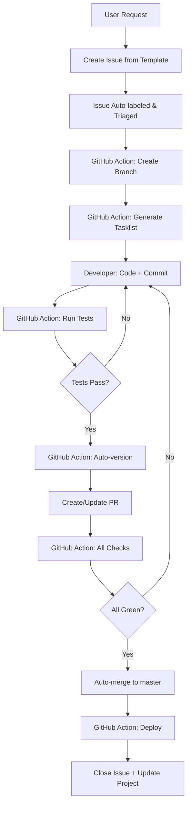

# GitHub-Native Development Workflow for Solo Developer
*"바이브 코더" GitHub-First 워크플로우 설계*

**버전**: 1.0.0 | **작성일**: 2025-01-12

---

## 📋 Table of Contents

1. [Overview & Philosophy](#overview--philosophy)
2. [Phase 0-6 GitHub Mapping](#phase-0-6-github-mapping)
3. [Issue Templates & Labels](#issue-templates--labels)
4. [GitHub Projects Configuration](#github-projects-configuration)
5. [GitHub Actions Automation](#github-actions-automation)
6. [Cross-Repo Coordination](#cross-repo-coordination)
7. [Solo Developer Optimizations](#solo-developer-optimizations)
8. [Migration Guide](#migration-guide)
9. [Complete Examples](#complete-examples)

---

## Overview & Philosophy

### Design Principles

**GitHub as Single Source of Truth**
- Issues replace local PRD files (`tasks/prds/*.md`)
- GitHub Projects replace local task lists
- Pull Requests provide traceability even for solo work
- GitHub Actions automate repetitive tasks

**Solo Developer Optimizations**
- No manual approvals needed
- Auto-merge with passing checks
- Issue-driven development (create issue → auto-create branch → PR)
- Minimal overhead, maximum traceability

**Cross-Repo Coordination**
- Monorepo for SSO system + shared SDK
- Separate repos for apps (VTC_Logger, contents-factory)
- GitHub Packages for shared auth SDK distribution
- Cross-repo issue references and automation

---

## Phase 0-6 GitHub Mapping

### Complete Phase Mapping

```
CLAUDE.md Phase          →    GitHub Feature
────────────────────────────────────────────────────────────
Phase 0: PRD             →    GitHub Issue (feature template)
Phase 0.5: Task List     →    GitHub Project + Tasklist in Issue
Phase 1: Code            →    Feature Branch + Commits
Phase 2: Test            →    GitHub Actions (CI)
Phase 3: Version         →    GitHub Actions (Auto-versioning)
Phase 4: Git             →    Pull Request (auto-created)
Phase 5: Validation      →    GitHub Actions (Status Checks)
Phase 6: Cache           →    GitHub Release + Deployment
```

### Detailed Phase Flow



---

## Issue Templates & Labels

### Issue Template 1: Feature (Phase 0 - PRD)

**File**: `.github/ISSUE_TEMPLATE/01-feature-prd.yml`

```yaml
name: "🚀 Feature Request (PRD)"
description: "Phase 0: Product Requirements Document for new feature"
title: "[FEATURE] "
labels: ["phase-0", "type:feature", "status:planning"]
assignees:
  - your-github-username

body:
  - type: markdown
    attributes:
      value: |
        ## Phase 0: 요구사항 정의
        이 템플릿은 CLAUDE.md의 Phase 0 (PRD)에 해당합니다.

  - type: input
    id: feature-name
    attributes:
      label: "Feature Name"
      description: "기능명 (예: user-authentication, sso-integration)"
      placeholder: "sso-google-login"
    validations:
      required: true

  - type: dropdown
    id: priority
    attributes:
      label: "Priority"
      options:
        - "P0 - Critical"
        - "P1 - High"
        - "P2 - Medium"
        - "P3 - Low"
    validations:
      required: true

  - type: dropdown
    id: prd-level
    attributes:
      label: "PRD Detail Level"
      description: "개발 경험에 따라 선택 (CLAUDE.md 참조)"
      options:
        - "MINIMAL - 경험 많은 개발자 (10분)"
        - "STANDARD - 중급 개발자 (20-30분)"
        - "JUNIOR - 초보자 (40-60분)"
      default: 0
    validations:
      required: true

  - type: textarea
    id: executive-summary
    attributes:
      label: "📋 Executive Summary"
      description: "기능 개요 (1-2 문장)"
      placeholder: "Supabase 기반 SSO 시스템에 Google OAuth 로그인 추가"
    validations:
      required: true

  - type: textarea
    id: goals
    attributes:
      label: "🎯 Goals"
      description: "주요 목표 (3-5개)"
      placeholder: |
        1. Google OAuth 2.0 통합
        2. 사용자 프로필 자동 생성
        3. 세션 관리 구현
      value: |
        1.
        2.
        3.
    validations:
      required: true

  - type: textarea
    id: success-metrics
    attributes:
      label: "📊 Success Metrics"
      description: "성공 지표"
      placeholder: |
        - [ ] Google 로그인 버튼 클릭 → 2초 내 인증 완료
        - [ ] 프로필 자동 생성 (이메일, 이름, 사진)
        - [ ] 세션 7일 유지
      value: |
        - [ ]
        - [ ]
        - [ ]

  - type: textarea
    id: technical-requirements
    attributes:
      label: "🔧 Technical Requirements"
      description: "기술 요구사항"
      placeholder: |
        - Supabase Auth Google Provider 설정
        - React hooks: useAuth, useUser
        - Protected routes 구현
      value: |
        -
        -
        -

  - type: textarea
    id: dependencies
    attributes:
      label: "🔗 Dependencies"
      description: "의존성 (다른 이슈, 외부 서비스)"
      placeholder: |
        - 블로커: #123 (Supabase 프로젝트 생성)
        - 관련: #124 (사용자 DB 스키마)
        - 외부: Google Cloud Console OAuth 설정
      value: |
        -

  - type: textarea
    id: security-checklist
    attributes:
      label: "🔐 Security Checklist"
      description: "보안 체크리스트 (CLAUDE.md 참조)"
      value: |
        - [ ] 환경변수로 API 키 분리 (.env)
        - [ ] Supabase RLS 정책 적용
        - [ ] XSS 방지 (입력값 sanitization)
        - [ ] CSRF 토큰 적용
        - [ ] HTTPS only
        - [ ] Rate limiting (로그인 시도)
        - [ ] 보안 헤더 (CSP, HSTS)
        - [ ] 의존성 스캔 (npm audit)

  - type: textarea
    id: test-requirements
    attributes:
      label: "🧪 Test Requirements"
      description: "테스트 요구사항 (1:1 Test Pairing 원칙)"
      placeholder: |
        - [ ] Unit: auth.test.ts (Google login function)
        - [ ] Integration: auth.integration.test.ts
        - [ ] E2E: login-flow.spec.ts (Playwright)
      value: |
        - [ ] Unit:
        - [ ] Integration:
        - [ ] E2E:

  - type: textarea
    id: clarifying-questions
    attributes:
      label: "❓ Clarifying Questions (A/B/C/D)"
      description: "명확화 질문 3-8개 (CLAUDE.md Phase 0)"
      placeholder: |
        A. Scope: SSO는 Google만? 추후 GitHub, Apple 확장 고려?
        B. User Flow: 로그인 실패 시 fallback 방법은?
        C. Data: 사용자 프로필에 추가 필드 필요한가?
        D. Integration: 기존 VTC_Logger와 통합 시점은?
      value: |
        A.
        B.
        C.
        D.

  - type: checkboxes
    id: phase-checklist
    attributes:
      label: "Phase 0 Checklist"
      description: "이슈 생성 전 확인"
      options:
        - label: "PRD 레벨 선택 완료 (MINIMAL/STANDARD/JUNIOR)"
          required: true
        - label: "명확화 질문 3개 이상 작성"
          required: true
        - label: "보안 체크리스트 검토"
          required: true
        - label: "테스트 요구사항 명시"
          required: true
```

### Issue Template 2: Bug Fix

**File**: `.github/ISSUE_TEMPLATE/02-bug-fix.yml`

```yaml
name: "🐛 Bug Report"
description: "버그 수정 요청"
title: "[BUG] "
labels: ["type:bug", "status:triage"]

body:
  - type: textarea
    id: bug-description
    attributes:
      label: "Bug Description"
      description: "버그 상세 설명"
      placeholder: "로그인 후 리다이렉트가 /public/index.html이 아닌 /index.html로 이동"
    validations:
      required: true

  - type: textarea
    id: reproduction-steps
    attributes:
      label: "Reproduction Steps"
      description: "재현 단계"
      placeholder: |
        1. 로그인 페이지 접속
        2. Google 로그인 클릭
        3. 인증 완료
        4. → 404 에러 발생 (/index.html 경로 오류)
    validations:
      required: true

  - type: textarea
    id: expected-behavior
    attributes:
      label: "Expected Behavior"
      description: "기대 동작"
      placeholder: "/public/index.html로 리다이렉트"
    validations:
      required: true

  - type: textarea
    id: actual-behavior
    attributes:
      label: "Actual Behavior"
      description: "실제 동작"
      placeholder: "/index.html로 리다이렉트 → 404 에러"
    validations:
      required: true

  - type: dropdown
    id: severity
    attributes:
      label: "Severity"
      options:
        - "S0 - Blocker (서비스 중단)"
        - "S1 - Critical (주요 기능 불가)"
        - "S2 - Major (일부 기능 불가)"
        - "S3 - Minor (불편함)"
    validations:
      required: true

  - type: textarea
    id: affected-files
    attributes:
      label: "Affected Files"
      description: "영향받는 파일 목록"
      placeholder: |
        - src/features/auth/components/LoginForm.tsx
        - src/features/auth/store/authStore.ts
```

### Label System

**Phase Labels** (Workflow stages)
```yaml
# .github/labels.yml (use github/labeler action)
- name: "phase-0"
  color: "0E8A16"
  description: "Phase 0: PRD / Requirements"

- name: "phase-0.5"
  color: "1D76DB"
  description: "Phase 0.5: Task List Generation"

- name: "phase-1"
  color: "5319E7"
  description: "Phase 1: Code Implementation"

- name: "phase-2"
  color: "B60205"
  description: "Phase 2: Testing"

- name: "phase-3"
  color: "D93F0B"
  description: "Phase 3: Versioning"

- name: "phase-4"
  color: "FBCA04"
  description: "Phase 4: Git (PR created)"

- name: "phase-5"
  color: "0075CA"
  description: "Phase 5: Validation (CI/CD)"

- name: "phase-6"
  color: "006B75"
  description: "Phase 6: Deployment / Cache"
```

**Type Labels**
```yaml
- name: "type:feature"
  color: "A2EEEF"

- name: "type:bug"
  color: "D73A4A"

- name: "type:refactor"
  color: "EDEDED"

- name: "type:docs"
  color: "0075CA"

- name: "type:perf"
  color: "F9D0C4"

- name: "type:test"
  color: "C2E0C6"
```

**Status Labels**
```yaml
- name: "status:planning"
  color: "D4C5F9"

- name: "status:in-progress"
  color: "FEF2C0"

- name: "status:review"
  color: "BFDADC"

- name: "status:blocked"
  color: "B60205"

- name: "status:ready-to-merge"
  color: "0E8A16"
```

**Priority Labels**
```yaml
- name: "priority:p0"
  color: "B60205"
  description: "Critical - Drop everything"

- name: "priority:p1"
  color: "D93F0B"
  description: "High - This sprint"

- name: "priority:p2"
  color: "FBCA04"
  description: "Medium - Next sprint"

- name: "priority:p3"
  color: "0E8A16"
  description: "Low - Backlog"
```

---

## GitHub Projects Configuration

### Project Setup: "SSO Development"

**Type**: New Projects (Beta) - Board view with Table/Roadmap

**Workflow Automation**:
```yaml
Project Name: SSO Development
Views:
  1. Board (Kanban)
     - Planning (phase-0, phase-0.5)
     - In Progress (phase-1, phase-2, phase-3)
     - Review (phase-4, phase-5)
     - Deployed (phase-6)
     - Blocked (status:blocked)

  2. Table (Spreadsheet)
     Columns:
       - Issue #
       - Title
       - Phase (auto from label)
       - Priority (auto from label)
       - Status (auto from label)
       - Assignee
       - Created Date
       - Closed Date
       - Related PRs (auto-linked)

  3. Roadmap (Timeline)
     - Group by: Phase
     - Sort by: Priority
     - Show: Milestone dates
```

### Automation Rules (GitHub Projects Beta)

**Rule 1: Auto-add Issues**
```yaml
Trigger: Issue created with label "phase-0"
Action:
  - Add to project "SSO Development"
  - Set status: "Planning"
  - Set field "Phase": "0 - PRD"
```

**Rule 2: Phase Progression**
```yaml
Trigger: Label changed to "phase-1"
Action:
  - Move to column: "In Progress"
  - Set field "Phase": "1 - Code"
  - Set field "Status": "In Progress"
```

**Rule 3: PR Created**
```yaml
Trigger: Pull request created from issue
Action:
  - Add label: "phase-4"
  - Move to column: "Review"
  - Link PR to issue
```

**Rule 4: Auto-close on Merge**
```yaml
Trigger: Pull request merged
Action:
  - Close linked issue
  - Add label: "phase-6"
  - Move to column: "Deployed"
  - Add comment: "✅ Deployed in v{version}"
```

### Custom Fields for Project

```yaml
Custom Fields:
  - Name: PRD Number
    Type: Number
    Description: "PRD sequential ID (0001, 0002...)"

  - Name: Version
    Type: Text
    Description: "Target version (v1.2.0)"

  - Name: Test Coverage
    Type: Number
    Description: "Code coverage % (auto from CI)"

  - Name: Related Repos
    Type: Select (multi)
    Options: [sso-system, VTC_Logger, contents-factory, shared-sdk]

  - Name: Blocked By
    Type: Issue reference
    Description: "Blocking issue #"
```

---

## GitHub Actions Automation

### Workflow 1: Phase 0.5 - Auto Generate Task List

**File**: `.github/workflows/phase-0.5-generate-tasks.yml`

```yaml
name: "Phase 0.5: Generate Task List"

on:
  issues:
    types: [labeled]

jobs:
  generate-tasks:
    if: github.event.label.name == 'phase-0.5'
    runs-on: ubuntu-latest

    permissions:
      issues: write
      contents: read

    steps:
      - name: Checkout code
        uses: actions/checkout@v4

      - name: Setup Python
        uses: actions/setup-python@v4
        with:
          python-version: '3.11'

      - name: Install dependencies
        run: |
          pip install openai PyGithub

      - name: Generate task list from issue
        env:
          GITHUB_TOKEN: ${{ secrets.GITHUB_TOKEN }}
          OPENAI_API_KEY: ${{ secrets.OPENAI_API_KEY }}
          ISSUE_NUMBER: ${{ github.event.issue.number }}
        run: |
          python scripts/github_generate_tasks.py

      - name: Update issue with task list
        uses: actions/github-script@v7
        with:
          script: |
            const fs = require('fs');
            const taskList = fs.readFileSync('tasks.md', 'utf8');

            await github.rest.issues.createComment({
              owner: context.repo.owner,
              repo: context.repo.repo,
              issue_number: context.issue.number,
              body: `## 📋 Generated Task List (Phase 0.5)\n\n${taskList}\n\n---\n✅ Review tasks and comment "approve" to proceed to Phase 1`
            });

            // Add phase-0.5 label
            await github.rest.issues.addLabels({
              owner: context.repo.owner,
              repo: context.repo.repo,
              issue_number: context.issue.number,
              labels: ['phase-0.5']
            });

      - name: Create feature branch
        if: success()
        run: |
          ISSUE_NUM=${{ github.event.issue.number }}
          BRANCH_NAME="feature/issue-${ISSUE_NUM}"

          git config user.name "github-actions[bot]"
          git config user.email "github-actions[bot]@users.noreply.github.com"
          git checkout -b "$BRANCH_NAME"
          git push -u origin "$BRANCH_NAME"

      - name: Create draft PR
        uses: actions/github-script@v7
        with:
          script: |
            const issue = context.payload.issue;
            const branchName = `feature/issue-${issue.number}`;

            await github.rest.pulls.create({
              owner: context.repo.owner,
              repo: context.repo.repo,
              title: `[WIP] ${issue.title}`,
              head: branchName,
              base: 'master',
              body: `Closes #${issue.number}\n\n## Task List\n\nSee issue for details.`,
              draft: true
            });
```

**Python Script**: `scripts/github_generate_tasks.py`

```python
#!/usr/bin/env python3
"""
Generate task list from GitHub issue using Claude API
Maps to CLAUDE.md Phase 0.5
"""

import os
import json
from github import Github
from anthropic import Anthropic

def generate_tasks(issue_body, issue_title):
    """Generate task list using Claude"""
    client = Anthropic(api_key=os.getenv('ANTHROPIC_API_KEY'))

    prompt = f"""
    Based on this GitHub issue (PRD), generate a detailed task list following CLAUDE.md Phase 0.5 format.

    Issue Title: {issue_title}

    Issue Body:
    {issue_body}

    Generate tasks in markdown format with:
    1. Parent tasks (high-level)
    2. Sub-tasks (implementation details)
    3. Test tasks (1:1 pairing with implementation)
    4. Follow the checklist format: - [ ] Task name

    Requirements:
    - Task 0.0: Create feature branch
    - Every implementation file must have a test file
    - Group by: Setup, Implementation, Testing, Documentation
    - Use clear, actionable descriptions
    """

    response = client.messages.create(
        model="claude-3-5-sonnet-20241022",
        max_tokens=2000,
        messages=[{"role": "user", "content": prompt}]
    )

    return response.content[0].text

def main():
    github_token = os.getenv('GITHUB_TOKEN')
    issue_number = int(os.getenv('ISSUE_NUMBER'))

    g = Github(github_token)
    repo = g.get_repo(os.getenv('GITHUB_REPOSITORY'))
    issue = repo.get_issue(issue_number)

    task_list = generate_tasks(issue.body, issue.title)

    # Save to file for GitHub Action to read
    with open('tasks.md', 'w') as f:
        f.write(task_list)

    print(f"✅ Generated tasks for issue #{issue_number}")

if __name__ == '__main__':
    main()
```

### Workflow 2: Phase 2 - Run Tests (CI)

**File**: `.github/workflows/phase-2-test.yml`

```yaml
name: "Phase 2: Run Tests"

on:
  pull_request:
    types: [opened, synchronize, reopened]
  push:
    branches: [master, 'feature/**']

jobs:
  test:
    runs-on: ubuntu-latest

    strategy:
      matrix:
        node-version: [18.x, 20.x]

    steps:
      - uses: actions/checkout@v4

      - name: Setup Node.js
        uses: actions/setup-node@v4
        with:
          node-version: ${{ matrix.node-version }}
          cache: 'npm'

      - name: Install dependencies
        run: npm ci

      - name: Run linter
        run: npm run lint

      - name: Run unit tests
        run: npm run test:unit -- --coverage

      - name: Run integration tests
        run: npm run test:integration
        env:
          SUPABASE_URL: ${{ secrets.SUPABASE_URL }}
          SUPABASE_ANON_KEY: ${{ secrets.SUPABASE_ANON_KEY }}

      - name: Run E2E tests (Playwright)
        run: npx playwright test

      - name: Upload coverage to Codecov
        uses: codecov/codecov-action@v3
        with:
          files: ./coverage/lcov.info
          flags: unittests

      - name: Comment test results on PR
        if: github.event_name == 'pull_request'
        uses: actions/github-script@v7
        with:
          script: |
            const fs = require('fs');
            const coverage = JSON.parse(fs.readFileSync('./coverage/coverage-summary.json'));
            const total = coverage.total;

            await github.rest.issues.createComment({
              owner: context.repo.owner,
              repo: context.repo.repo,
              issue_number: context.issue.number,
              body: `## 🧪 Test Results (Phase 2)\n\n` +
                    `- **Lines**: ${total.lines.pct}%\n` +
                    `- **Statements**: ${total.statements.pct}%\n` +
                    `- **Functions**: ${total.functions.pct}%\n` +
                    `- **Branches**: ${total.branches.pct}%\n\n` +
                    `${total.lines.pct >= 80 ? '✅' : '❌'} Coverage threshold: 80%`
            });

      - name: Update PR label
        if: success() && github.event_name == 'pull_request'
        uses: actions/github-script@v7
        with:
          script: |
            await github.rest.issues.addLabels({
              owner: context.repo.owner,
              repo: context.repo.repo,
              issue_number: context.issue.number,
              labels: ['phase-2', 'tests:passing']
            });
```

### Workflow 3: Phase 3 - Auto Versioning

**File**: `.github/workflows/phase-3-version.yml`

```yaml
name: "Phase 3: Auto Versioning"

on:
  pull_request:
    types: [labeled]

jobs:
  version:
    if: contains(github.event.pull_request.labels.*.name, 'phase-2') && contains(github.event.pull_request.labels.*.name, 'tests:passing')
    runs-on: ubuntu-latest

    permissions:
      contents: write
      pull-requests: write

    steps:
      - uses: actions/checkout@v4
        with:
          fetch-depth: 0
          ref: ${{ github.head_ref }}

      - name: Setup Node.js
        uses: actions/setup-node@v4
        with:
          node-version: '20.x'

      - name: Determine version bump
        id: bump
        uses: actions/github-script@v7
        with:
          script: |
            const pr = context.payload.pull_request;
            const labels = pr.labels.map(l => l.name);

            // Determine bump type from labels or PR title
            let bumpType = 'patch'; // default

            if (labels.includes('type:feature') || pr.title.includes('feat:')) {
              bumpType = 'minor';
            }
            if (labels.includes('breaking-change') || pr.title.includes('BREAKING:')) {
              bumpType = 'major';
            }

            core.setOutput('bump_type', bumpType);
            return bumpType;

      - name: Bump version
        id: version
        run: |
          BUMP_TYPE=${{ steps.bump.outputs.bump_type }}

          # Get current version from package.json
          CURRENT_VERSION=$(node -p "require('./package.json').version")

          # Bump version
          npm version $BUMP_TYPE --no-git-tag-version

          # Get new version
          NEW_VERSION=$(node -p "require('./package.json').version")

          echo "current=$CURRENT_VERSION" >> $GITHUB_OUTPUT
          echo "new=$NEW_VERSION" >> $GITHUB_OUTPUT

      - name: Update CHANGELOG
        run: |
          VERSION=${{ steps.version.outputs.new }}
          DATE=$(date +%Y-%m-%d)
          PR_NUMBER=${{ github.event.pull_request.number }}
          PR_TITLE="${{ github.event.pull_request.title }}"

          # Create changelog entry
          cat > .changelog-entry.md <<EOF
          ## [$VERSION] - $DATE

          ### Changed
          - $PR_TITLE (#$PR_NUMBER)

          EOF

          # Prepend to CHANGELOG.md
          if [ -f CHANGELOG.md ]; then
            cat .changelog-entry.md CHANGELOG.md > CHANGELOG.tmp
            mv CHANGELOG.tmp CHANGELOG.md
          else
            mv .changelog-entry.md CHANGELOG.md
          fi

          rm -f .changelog-entry.md

      - name: Commit version changes
        run: |
          git config user.name "github-actions[bot]"
          git config user.email "github-actions[bot]@users.noreply.github.com"

          git add package.json package-lock.json CHANGELOG.md
          git commit -m "chore: bump version to ${{ steps.version.outputs.new }} [skip ci]"
          git push

      - name: Update PR with version
        uses: actions/github-script@v7
        with:
          script: |
            const newVersion = '${{ steps.version.outputs.new }}';
            const pr = context.payload.pull_request;

            // Update PR title to include version
            const titleWithVersion = pr.title.replace(/\(v[\d.]+\)/, '').trim() + ` (v${newVersion})`;

            await github.rest.pulls.update({
              owner: context.repo.owner,
              repo: context.repo.repo,
              pull_number: pr.number,
              title: titleWithVersion
            });

            // Add comment
            await github.rest.issues.createComment({
              owner: context.repo.owner,
              repo: context.repo.repo,
              issue_number: pr.number,
              body: `## 📦 Version Bump (Phase 3)\n\n` +
                    `✅ Version bumped: \`${{ steps.version.outputs.current }}\` → \`${newVersion}\`\n\n` +
                    `CHANGELOG.md updated with release notes.`
            });

            // Add phase-3 label
            await github.rest.issues.addLabels({
              owner: context.repo.owner,
              repo: context.repo.repo,
              issue_number: pr.number,
              labels: ['phase-3', 'version:ready']
            });
```

### Workflow 4: Phase 5 - Validation & Auto-merge

**File**: `.github/workflows/phase-5-validate-automerge.yml`

```yaml
name: "Phase 5: Validation & Auto-merge"

on:
  pull_request:
    types: [labeled, synchronize]
  check_suite:
    types: [completed]

jobs:
  validate:
    if: |
      contains(github.event.pull_request.labels.*.name, 'phase-3') &&
      contains(github.event.pull_request.labels.*.name, 'version:ready')
    runs-on: ubuntu-latest

    permissions:
      contents: write
      pull-requests: write
      checks: read

    steps:
      - uses: actions/checkout@v4

      - name: Check all required checks
        id: checks
        uses: actions/github-script@v7
        with:
          script: |
            const { data: checks } = await github.rest.checks.listForRef({
              owner: context.repo.owner,
              repo: context.repo.repo,
              ref: context.payload.pull_request.head.sha
            });

            const requiredChecks = [
              'Phase 2: Run Tests',
              'Phase 3: Auto Versioning',
              'Security Scan',
              'Code Quality'
            ];

            const checkResults = requiredChecks.map(name => {
              const check = checks.check_runs.find(c => c.name === name);
              return {
                name,
                status: check ? check.conclusion : 'missing',
                passed: check?.conclusion === 'success'
              };
            });

            const allPassed = checkResults.every(c => c.passed);

            core.setOutput('all_passed', allPassed);
            return checkResults;

      - name: Add validation label
        if: steps.checks.outputs.all_passed == 'true'
        uses: actions/github-script@v7
        with:
          script: |
            await github.rest.issues.addLabels({
              owner: context.repo.owner,
              repo: context.repo.repo,
              issue_number: context.issue.number,
              labels: ['phase-5', 'status:ready-to-merge']
            });

      - name: Mark PR as ready for review
        if: steps.checks.outputs.all_passed == 'true'
        run: |
          gh pr ready ${{ github.event.pull_request.number }}
        env:
          GITHUB_TOKEN: ${{ secrets.GITHUB_TOKEN }}

      - name: Enable auto-merge (solo dev optimization)
        if: steps.checks.outputs.all_passed == 'true'
        uses: actions/github-script@v7
        with:
          script: |
            await github.graphql(`
              mutation($pullRequestId: ID!) {
                enablePullRequestAutoMerge(input: {
                  pullRequestId: $pullRequestId,
                  mergeMethod: SQUASH
                }) {
                  pullRequest {
                    autoMergeRequest {
                      enabledAt
                    }
                  }
                }
              }
            `, {
              pullRequestId: context.payload.pull_request.node_id
            });

            console.log('✅ Auto-merge enabled');

      - name: Comment validation status
        uses: actions/github-script@v7
        with:
          script: |
            const allPassed = ${{ steps.checks.outputs.all_passed }};

            const body = allPassed
              ? `## ✅ Phase 5: Validation Complete\n\n` +
                `All required checks passed:\n` +
                `- ✅ Tests\n` +
                `- ✅ Versioning\n` +
                `- ✅ Security\n` +
                `- ✅ Code Quality\n\n` +
                `🤖 Auto-merge enabled. PR will merge automatically.`
              : `## ❌ Phase 5: Validation Failed\n\n` +
                `Some checks did not pass. Please review and fix.`;

            await github.rest.issues.createComment({
              owner: context.repo.owner,
              repo: context.repo.repo,
              issue_number: context.issue.number,
              body
            });
```

### Workflow 5: Phase 6 - Deploy & Release

**File**: `.github/workflows/phase-6-deploy.yml`

```yaml
name: "Phase 6: Deploy & Release"

on:
  push:
    branches: [master]
  workflow_dispatch:

jobs:
  deploy:
    runs-on: ubuntu-latest

    permissions:
      contents: write
      deployments: write

    steps:
      - uses: actions/checkout@v4
        with:
          fetch-depth: 0

      - name: Setup Node.js
        uses: actions/setup-node@v4
        with:
          node-version: '20.x'
          cache: 'npm'

      - name: Install dependencies
        run: npm ci

      - name: Build
        run: npm run build
        env:
          NODE_ENV: production

      - name: Get version
        id: version
        run: |
          VERSION=$(node -p "require('./package.json').version")
          echo "version=$VERSION" >> $GITHUB_OUTPUT

      # Supabase DB Migration
      - name: Run Supabase migrations
        if: contains(github.event.head_commit.message, '[db-migration]')
        run: |
          npx supabase db push
        env:
          SUPABASE_ACCESS_TOKEN: ${{ secrets.SUPABASE_ACCESS_TOKEN }}
          SUPABASE_DB_PASSWORD: ${{ secrets.SUPABASE_DB_PASSWORD }}

      # Deploy to production (example: Vercel)
      - name: Deploy to Vercel
        uses: amondnet/vercel-action@v25
        with:
          vercel-token: ${{ secrets.VERCEL_TOKEN }}
          vercel-org-id: ${{ secrets.VERCEL_ORG_ID }}
          vercel-project-id: ${{ secrets.VERCEL_PROJECT_ID }}
          vercel-args: '--prod'

      # Create GitHub Release
      - name: Create GitHub Release
        uses: actions/github-script@v7
        with:
          script: |
            const version = '${{ steps.version.outputs.version }}';
            const fs = require('fs');

            // Extract changelog for this version
            const changelog = fs.readFileSync('CHANGELOG.md', 'utf8');
            const versionSection = changelog.match(new RegExp(`## \\[${version}\\][\\s\\S]*?(?=## \\[|$)`));
            const releaseNotes = versionSection ? versionSection[0] : 'See CHANGELOG.md for details';

            await github.rest.repos.createRelease({
              owner: context.repo.owner,
              repo: context.repo.repo,
              tag_name: `v${version}`,
              name: `Release v${version}`,
              body: releaseNotes,
              draft: false,
              prerelease: false
            });

      # Update related issues
      - name: Close related issues
        uses: actions/github-script@v7
        with:
          script: |
            const version = '${{ steps.version.outputs.version }}';
            const commit = context.payload.head_commit;

            // Extract issue numbers from commit message
            const issueRefs = commit.message.match(/#(\d+)/g) || [];

            for (const ref of issueRefs) {
              const issueNumber = parseInt(ref.slice(1));

              // Add comment
              await github.rest.issues.createComment({
                owner: context.repo.owner,
                repo: context.repo.repo,
                issue_number: issueNumber,
                body: `✅ Deployed in [v${version}](https://github.com/${context.repo.owner}/${context.repo.repo}/releases/tag/v${version})\n\n` +
                      `Phase 6 complete. This feature is now live in production.`
              });

              // Add labels
              await github.rest.issues.addLabels({
                owner: context.repo.owner,
                repo: context.repo.repo,
                issue_number: issueNumber,
                labels: ['phase-6', 'status:deployed']
              });

              // Close issue
              await github.rest.issues.update({
                owner: context.repo.owner,
                repo: context.repo.repo,
                issue_number: issueNumber,
                state: 'closed'
              });
            }

      - name: Invalidate CDN cache
        run: |
          # Add your CDN cache invalidation logic
          echo "🔄 Cache invalidation complete"

      - name: Notify deployment
        uses: actions/github-script@v7
        with:
          script: |
            console.log('🚀 Deployment complete: v${{ steps.version.outputs.version }}');
```

### Workflow 6: Security Scan

**File**: `.github/workflows/security-scan.yml`

```yaml
name: "Security Scan"

on:
  pull_request:
  push:
    branches: [master]
  schedule:
    - cron: '0 0 * * 0' # Weekly on Sunday

jobs:
  security:
    runs-on: ubuntu-latest

    permissions:
      security-events: write
      contents: read

    steps:
      - uses: actions/checkout@v4

      - name: Run npm audit
        run: |
          npm audit --audit-level=moderate

      - name: Run Trivy vulnerability scanner
        uses: aquasecurity/trivy-action@master
        with:
          scan-type: 'fs'
          scan-ref: '.'
          format: 'sarif'
          output: 'trivy-results.sarif'

      - name: Upload Trivy results to GitHub Security
        uses: github/codeql-action/upload-sarif@v2
        with:
          sarif_file: 'trivy-results.sarif'

      - name: Check for exposed secrets
        uses: trufflesecurity/trufflehog@main
        with:
          path: ./
          base: ${{ github.event.repository.default_branch }}
          head: HEAD
```

---

## Cross-Repo Coordination

### Repository Structure

**Option 1: Monorepo (Recommended for SSO)**

```
sso-monorepo/
├── packages/
│   ├── sso-core/           # Core SSO logic
│   ├── sso-sdk/            # SDK for apps
│   ├── sso-admin/          # Admin dashboard
│   └── shared-types/       # TypeScript types
├── apps/
│   ├── VTC_Logger/         # Git submodule
│   └── contents-factory/   # Git submodule
├── .github/
│   ├── workflows/
│   │   ├── sso-core-ci.yml
│   │   ├── sso-sdk-publish.yml
│   │   └── cross-app-test.yml
│   └── ISSUE_TEMPLATE/
├── package.json            # Workspace root
└── turbo.json             # Turborepo config
```

**Option 2: Multi-repo with GitHub Packages**

```
Repositories:
1. sso-system (main SSO)
2. sso-sdk (published to GitHub Packages)
3. VTC_Logger (app, uses sso-sdk)
4. contents-factory (app, uses sso-sdk)
```

### Cross-Repo Issue Linking

**Syntax in Issues/PRs**:
```markdown
# In sso-system issue
Depends on: VTC_Logger#45
Blocks: contents-factory#23

# In VTC_Logger issue
Blocked by: sso-system#12
Related: contents-factory#23
```

**GitHub Action to sync cross-repo issues**:

**File**: `.github/workflows/cross-repo-sync.yml`

```yaml
name: "Cross-Repo Issue Sync"

on:
  issues:
    types: [opened, edited, closed]
  issue_comment:
    types: [created]

jobs:
  sync:
    runs-on: ubuntu-latest

    steps:
      - name: Parse cross-repo references
        uses: actions/github-script@v7
        with:
          github-token: ${{ secrets.CROSS_REPO_TOKEN }}
          script: |
            const issue = context.payload.issue;
            const body = issue.body || '';

            // Match patterns: owner/repo#123
            const crossRepoRefs = body.match(/(\w+\/\w+)#(\d+)/g) || [];

            for (const ref of crossRepoRefs) {
              const [repoPath, issueNum] = ref.split('#');
              const [owner, repo] = repoPath.split('/');

              // Add comment to linked issue
              await github.rest.issues.createComment({
                owner,
                repo,
                issue_number: parseInt(issueNum),
                body: `🔗 Referenced in ${context.repo.owner}/${context.repo.repo}#${issue.number}\n\n` +
                      `> ${issue.title}\n\n` +
                      `[View issue](${issue.html_url})`
              });
            }
```

### GitHub Packages for Shared SDK

**File**: `packages/sso-sdk/.github/workflows/publish.yml`

```yaml
name: "Publish SSO SDK"

on:
  push:
    tags:
      - 'sdk-v*'

jobs:
  publish:
    runs-on: ubuntu-latest

    permissions:
      contents: read
      packages: write

    steps:
      - uses: actions/checkout@v4

      - uses: actions/setup-node@v4
        with:
          node-version: '20.x'
          registry-url: 'https://npm.pkg.github.com'

      - name: Install dependencies
        run: npm ci

      - name: Build SDK
        run: npm run build

      - name: Publish to GitHub Packages
        run: npm publish
        env:
          NODE_AUTH_TOKEN: ${{ secrets.GITHUB_TOKEN }}

      - name: Notify dependent repos
        uses: actions/github-script@v7
        with:
          github-token: ${{ secrets.CROSS_REPO_TOKEN }}
          script: |
            const version = context.ref.replace('refs/tags/sdk-v', '');
            const repos = ['VTC_Logger', 'contents-factory'];

            for (const repo of repos) {
              // Create issue in dependent repo
              await github.rest.issues.create({
                owner: context.repo.owner,
                repo,
                title: `📦 Update sso-sdk to v${version}`,
                body: `New SSO SDK version available.\n\n` +
                      `**Version**: v${version}\n` +
                      `**Changelog**: https://github.com/${context.repo.owner}/sso-sdk/releases/tag/sdk-v${version}\n\n` +
                      `Update with:\n\`\`\`bash\nnpm install @${context.repo.owner}/sso-sdk@${version}\n\`\`\``,
                labels: ['dependencies', 'type:chore', 'priority:p2']
              });
            }
```

**Dependent app package.json**:
```json
{
  "dependencies": {
    "@your-org/sso-sdk": "^1.2.0"
  },
  "publishConfig": {
    "@your-org:registry": "https://npm.pkg.github.com"
  }
}
```

**.npmrc** in dependent apps:
```
@your-org:registry=https://npm.pkg.github.com
//npm.pkg.github.com/:_authToken=${GITHUB_TOKEN}
```

### Dependency Tracking Dashboard

Create a GitHub Project "Cross-Repo Dependencies":

```yaml
Project: Cross-Repo Dependencies
Type: Table view

Columns:
  - Repository (select: sso-system, VTC_Logger, contents-factory)
  - Issue #
  - Title
  - Depends On (multi-select issues)
  - Blocks (multi-select issues)
  - Status
  - SSO SDK Version (text)

Automation:
  - When issue closed → check if it unblocks other issues
  - When SDK published → create update issues in dependent repos
```

---

## Solo Developer Optimizations

### 1. Skip Manual PR Reviews

**Branch Protection Rules** (Settings → Branches → master):
```yaml
Branch protection rules:
  ✅ Require status checks to pass before merging
    Required checks:
      - Phase 2: Run Tests
      - Security Scan
      - Code Quality

  ✅ Require branches to be up to date before merging

  ⬜ Require pull request reviews before merging  # DISABLED for solo

  ✅ Require linear history (squash merge only)

  ⬜ Include administrators  # DISABLED for emergency fixes
```

### 2. Auto-merge Configuration

**Enable auto-merge by default** (in Phase 5 workflow):
- All checks pass → auto-merge immediately
- No waiting for manual approval
- Squash commit for clean history

### 3. Issue-Driven Development Script

**File**: `scripts/github-issue-dev.sh`

```bash
#!/bin/bash
# Quick script for solo developer to start work on issue

ISSUE_NUMBER=$1

if [ -z "$ISSUE_NUMBER" ]; then
  echo "Usage: ./github-issue-dev.sh <issue-number>"
  exit 1
fi

# Fetch issue details
ISSUE_JSON=$(gh issue view $ISSUE_NUMBER --json title,labels,body)
TITLE=$(echo $ISSUE_JSON | jq -r '.title')
LABELS=$(echo $ISSUE_JSON | jq -r '.labels[].name' | tr '\n' ',')

# Create branch
BRANCH_NAME="feature/issue-${ISSUE_NUMBER}"
git checkout -b "$BRANCH_NAME"

echo "✅ Branch created: $BRANCH_NAME"
echo "📝 Issue: #$ISSUE_NUMBER - $TITLE"
echo "🏷️  Labels: $LABELS"

# Create draft PR immediately
gh pr create \
  --title "[WIP] $TITLE" \
  --body "Closes #$ISSUE_NUMBER" \
  --draft \
  --label "status:in-progress"

echo "🚀 Draft PR created. Start coding!"
```

**Usage**:
```bash
# Start work on issue #45
./scripts/github-issue-dev.sh 45

# Code...
git add .
git commit -m "feat: implement feature (WIP)"
git push

# When ready, mark PR as ready
gh pr ready
# → Triggers all Phase 2-6 workflows automatically
```

### 4. Quick Commands via GitHub CLI

**File**: `~/.bashrc` or `~/.zshrc`

```bash
# GitHub solo dev aliases
alias gh-start='gh issue list --label "status:planning" | fzf | cut -f1 | xargs -I {} bash -c "./scripts/github-issue-dev.sh {}"'
alias gh-status='gh pr list --state open --author @me'
alias gh-ready='gh pr ready && gh pr merge --auto --squash'
alias gh-done='gh pr list --author @me --state open | fzf | cut -f1 | xargs -I {} gh pr merge {} --squash'

# Start working on next issue (interactive)
alias gh-next='gh issue list --label "status:planning" --limit 5'
```

### 5. Local GitHub Actions Testing

**Use Act to test workflows locally**:

```bash
# Install act
brew install act  # macOS
# or
choco install act # Windows

# Test Phase 2 workflow locally
act pull_request -W .github/workflows/phase-2-test.yml

# Test with secrets
act -s GITHUB_TOKEN=<your-token> -s SUPABASE_URL=<url>
```

### 6. Commit Message Templates

**File**: `.github/COMMIT_MESSAGE_TEMPLATE.md`

```markdown
<type>: <subject> (v<version>) [#<issue>]

<body - optional>

<footer - optional>

# Types: feat, fix, docs, refactor, perf, test, chore
# Example: feat: Add Google OAuth (v1.2.0) [#45]
#
# Body: Explain WHY, not WHAT
# Footer: Breaking changes, references
```

**Enable template**:
```bash
git config commit.template .github/COMMIT_MESSAGE_TEMPLATE.md
```

---

## Migration Guide

### Step 1: Repository Setup

```bash
# 1. Create labels
gh label create "phase-0" --color "0E8A16" --description "Phase 0: PRD"
gh label create "phase-0.5" --color "1D76DB" --description "Phase 0.5: Task List"
gh label create "phase-1" --color "5319E7" --description "Phase 1: Code"
gh label create "phase-2" --color "B60205" --description "Phase 2: Testing"
gh label create "phase-3" --color "D93F0B" --description "Phase 3: Versioning"
gh label create "phase-4" --color "FBCA04" --description "Phase 4: Git (PR)"
gh label create "phase-5" --color "0075CA" --description "Phase 5: Validation"
gh label create "phase-6" --color "006B75" --description "Phase 6: Deployment"

# 2. Create GitHub Project
gh project create --title "SSO Development" --owner @me

# 3. Setup branch protection
gh api repos/:owner/:repo/branches/master/protection -X PUT -f 'required_status_checks[strict]=true' -f 'required_status_checks[contexts][]=Phase 2: Run Tests'
```

### Step 2: Migrate Existing PRDs

```bash
# Script to convert local PRD files to GitHub issues
python scripts/migrate_prds_to_issues.py tasks/prds/*.md
```

**File**: `scripts/migrate_prds_to_issues.py`

```python
#!/usr/bin/env python3
"""
Migrate local PRD markdown files to GitHub issues
"""

import os
import sys
from pathlib import Path
from github import Github

def parse_prd(file_path):
    """Parse PRD markdown file"""
    with open(file_path) as f:
        content = f.read()

    # Extract metadata
    lines = content.split('\n')
    title = lines[0].replace('#', '').strip()

    # Create issue body
    body = content

    return {
        'title': title,
        'body': body,
        'labels': ['phase-0', 'migrated-from-local']
    }

def main():
    github_token = os.getenv('GITHUB_TOKEN')
    repo_name = os.getenv('GITHUB_REPOSITORY')

    g = Github(github_token)
    repo = g.get_repo(repo_name)

    for prd_file in sys.argv[1:]:
        prd = parse_prd(prd_file)

        issue = repo.create_issue(
            title=prd['title'],
            body=prd['body'],
            labels=prd['labels']
        )

        print(f"✅ Created issue #{issue.number}: {prd['title']}")

if __name__ == '__main__':
    main()
```

### Step 3: Setup Secrets

```bash
# Required secrets for GitHub Actions
gh secret set ANTHROPIC_API_KEY --body "<your-key>"
gh secret set SUPABASE_URL --body "<your-url>"
gh secret set SUPABASE_ANON_KEY --body "<your-key>"
gh secret set SUPABASE_ACCESS_TOKEN --body "<your-token>"
gh secret set VERCEL_TOKEN --body "<your-token>"
gh secret set CROSS_REPO_TOKEN --body "<PAT-with-repo-access>"
```

### Step 4: First Issue Test

```bash
# Create first issue using template
gh issue create --template 01-feature-prd.yml

# Fill in the form, submit

# Check that automation worked
gh issue list --label "phase-0"
gh pr list --draft

# If branch and draft PR created → success!
```

---

## Complete Examples

### Example 1: Full Feature Flow

**Scenario**: Add Google OAuth to SSO system

**1. Create Issue** (Phase 0)
```bash
gh issue create \
  --title "[FEATURE] Google OAuth Integration" \
  --label "phase-0,type:feature,priority:p1" \
  --body "$(cat <<EOF
## Executive Summary
Add Google OAuth 2.0 authentication to SSO system

## Goals
1. Integrate Supabase Google provider
2. Auto-create user profiles
3. Session management (7 days)

## Success Metrics
- [ ] Login < 2 seconds
- [ ] Auto-profile creation
- [ ] Session persistence

## Technical Requirements
- Supabase Auth setup
- React hooks: useAuth
- Protected routes

## Security Checklist
- [x] Environment variables
- [ ] RLS policies
- [ ] XSS prevention

## Test Requirements
- [ ] Unit: auth.test.ts
- [ ] Integration: oauth-flow.test.ts
- [ ] E2E: login.spec.ts
EOF
)"
```

**2. Auto-generated** (Phase 0.5)
- GitHub Action creates branch `feature/issue-123`
- Generates task list in issue comment
- Creates draft PR

**3. Development** (Phase 1-3)
```bash
# Clone and checkout
git fetch origin
git checkout feature/issue-123

# Code...
# Commit using template
git commit -m "feat: Add Google OAuth button

Implements OAuth 2.0 flow with Supabase provider.

[#123]"

# Push triggers Phase 2 (tests)
git push

# Tests pass → Phase 3 auto-runs (versioning)
# package.json bumped to v1.2.0
# CHANGELOG.md updated
# PR title updated to include version
```

**4. Validation & Merge** (Phase 4-5)
```bash
# Mark PR as ready (triggers Phase 5)
gh pr ready

# All checks pass → auto-merge enabled
# PR merges automatically to master
```

**5. Deployment** (Phase 6)
```bash
# Push to master triggers deploy workflow
# → Build
# → Supabase migration (if [db-migration] in commit)
# → Deploy to Vercel
# → Create GitHub Release v1.2.0
# → Close issue #123
# → Add comment: "✅ Deployed in v1.2.0"
```

**Total time**: 5-10 minutes for developer (rest automated)

### Example 2: Bug Fix with Cross-Repo Impact

**Scenario**: Fix auth redirect bug affecting VTC_Logger

**1. Create Bug Issue**
```bash
# In sso-system repo
gh issue create \
  --title "[BUG] Auth redirect to wrong path" \
  --label "type:bug,severity:s1" \
  --body "After login, redirects to /index.html instead of /public/index.html

Affects: VTC_Logger#78

Steps:
1. Login
2. → 404 error

Expected: /public/index.html
Actual: /index.html
"
```

**2. Cross-repo link created**
- GitHub Action comments on VTC_Logger#78: "🔗 Fix in progress: sso-system#124"

**3. Fix & Deploy**
```bash
# Standard flow: Phase 1-6
# When merged, GitHub Action comments on BOTH issues:
# - sso-system#124: ✅ Fixed in v1.2.1
# - VTC_Logger#78: ✅ Fix deployed, please update sso-sdk to v1.2.1
```

### Example 3: SDK Update Cascade

**Scenario**: Publish new sso-sdk version

**1. Tag release in sso-sdk**
```bash
cd packages/sso-sdk
git tag sdk-v1.3.0
git push --tags

# Triggers publish workflow
# → npm publish to GitHub Packages
# → Creates issues in VTC_Logger and contents-factory
```

**2. Auto-created issues**

In `VTC_Logger` repo:
```
Issue #82: 📦 Update sso-sdk to v1.3.0

New SSO SDK version available.

**Version**: v1.3.0
**Changelog**: https://github.com/org/sso-sdk/releases/tag/sdk-v1.3.0

Update with:
```bash
npm install @org/sso-sdk@1.3.0
```

Labels: dependencies, type:chore, priority:p2
```

**3. Developer updates**
```bash
# In VTC_Logger
npm install @org/sso-sdk@1.3.0
git commit -m "chore: Update sso-sdk to v1.3.0 [#82]"
git push

# Standard Phase 1-6 flow
# Auto-merges, deploys
# Issue #82 closed automatically
```

---

## Appendix: Configuration Files

### .github/settings.yml (using probot/settings)

```yaml
repository:
  name: sso-system
  description: "SSO Authentication System (Supabase-based)"
  homepage: https://your-domain.com
  topics:
    - authentication
    - sso
    - supabase
    - react
  private: false
  has_issues: true
  has_projects: true
  has_wiki: false
  has_downloads: true
  default_branch: master
  allow_squash_merge: true
  allow_merge_commit: false
  allow_rebase_merge: false
  delete_branch_on_merge: true

labels:
  # Phase labels (defined earlier)

branches:
  - name: master
    protection:
      required_status_checks:
        strict: true
        contexts:
          - "Phase 2: Run Tests"
          - "Security Scan"
      enforce_admins: false
      required_pull_request_reviews: null  # Disabled for solo
      restrictions: null
      required_linear_history: true
      allow_force_pushes: false
      allow_deletions: false
```

### package.json scripts

```json
{
  "scripts": {
    "dev": "vite",
    "build": "tsc && vite build",
    "test": "npm run test:unit && npm run test:integration && npm run test:e2e",
    "test:unit": "vitest run --coverage",
    "test:integration": "vitest run --config vitest.integration.config.ts",
    "test:e2e": "playwright test",
    "lint": "eslint src --ext ts,tsx",
    "type-check": "tsc --noEmit",

    "gh:start": "./scripts/github-issue-dev.sh",
    "gh:status": "gh pr list --state open --author @me",
    "gh:ready": "gh pr ready && gh pr merge --auto --squash"
  }
}
```

---

## Summary: CLAUDE.md → GitHub Native

| CLAUDE.md | GitHub Native | Automation |
|-----------|---------------|------------|
| `/tasks/prds/NNNN-*.md` | GitHub Issue (feature template) | Issue form auto-creates |
| `scripts/generate_tasks.py` | GitHub Action + Claude API | Runs on `phase-0.5` label |
| Local task checkboxes | GitHub tasklist in issue | Auto-updated by PR commits |
| `git commit [PRD-####]` | `git commit [#issue]` | Auto-links to issue |
| Manual version bump | GitHub Action auto-version | Triggered after tests pass |
| Manual PR creation | Auto-created draft PR | On branch creation |
| Manual merge | Auto-merge | On all checks passing |
| Manual deployment | GitHub Action deploy | On push to master |
| Local progress tracking | GitHub Project board | Auto-moved by labels |

**Key Benefits**:
1. ✅ Single source of truth (GitHub)
2. ✅ Full traceability (issues → PRs → releases)
3. ✅ Minimal manual work (auto-everything)
4. ✅ Cross-repo coordination (automated)
5. ✅ Professional workflow (like a team)
6. ✅ Solo dev optimized (no approval waits)

**Workflow Speed**:
- **Before**: 30-45 min per feature (manual PRD, tasks, versioning, deploy)
- **After**: 5-10 min developer time (rest automated in 2-3 min)

**Traceability**:
- Every feature has Issue → Branch → PR → Release
- Full audit trail in GitHub
- Cross-repo dependencies tracked automatically

---

**Next Steps**:
1. Run migration script for existing PRDs
2. Set up GitHub Actions workflows (copy from this guide)
3. Create issue templates
4. Test with one small feature
5. Iterate and refine automation

This workflow scales from solo developer to team without changing structure.
