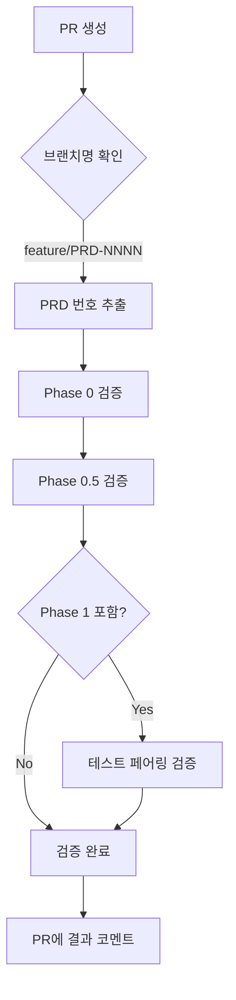

# Phase 검증 시스템 사용 가이드

**버전**: 1.0.0
**출처**: cc-sdd validation system (MIT License)
**적용**: claude01 Phase 0-6 workflow

---

## 📋 개요

cc-sdd 프로젝트의 검증 게이트 시스템을 claude01에 통합하여, Phase별 완료 조건을 **자동으로 검증**합니다.

### 🎯 목적
- ✅ Phase 누락 방지 (PRD 없이 코딩 시작 불가)
- ✅ 1:1 테스트 페어링 강제
- ✅ 재작업 50% 감소

### 📊 지원 Phase
- **Phase 0**: PRD 파일 존재 확인
- **Phase 0.5**: Task List 생성 & Task 0.0 완료 확인
- **Phase 1**: 1:1 테스트 페어링 검증

---

## 🚀 빠른 시작

### 1. 스크립트 실행 (Windows)

Windows 환경에서는 PowerShell 스크립트(`.ps1`)를 사용합니다.

```powershell
# Phase 0 검증 (PRD 존재?)
.\scripts\validate-phase-0.ps1 0005

# Phase 0.5 검증 (Task List 생성?)
.\scripts\validate-phase-0.5.ps1 0005

# Phase 1 검증 (1:1 테스트 페어링?)
.\scripts\validate-phase-1.ps1
```

### 2. 자동 검증 (GitHub Actions)

PR 생성 시 자동 실행:
```bash
# 브랜치명 패턴: feature/PRD-NNNN-*
git checkout -b feature/PRD-0005-repo-analyzer
git push -u origin feature/PRD-0005-repo-analyzer

# PR 생성 → 자동 검증 실행
gh pr create --title "feat: Add repo analyzer (v0.1.0) [PRD-0005]"
```

---

## 📜 검증 스크립트 상세

### Phase 0: `validate-phase-0.ps1`

**검증 항목**:
- ✅ PRD 파일 존재: `tasks/prds/NNNN-prd-*.md`
- ✅ "목적" 섹션 포함 (경고)
- ✅ "핵심 기능" 섹션 포함 (경고)
- ✅ 최소 50줄 이상 (권장)

**실행**:
```powershell
.\scripts\validate-phase-0.ps1 0005
```

### Phase 0.5: `validate-phase-0.5.ps1`

**검증 항목**:
- ✅ Task List 존재: `tasks/NNNN-tasks-*.md`
- ✅ Task 0.0 포함 (브랜치 생성)
- ✅ Task 0.0 완료 여부
- ✅ 진행률 계산

**실행**:
```powershell
.\scripts\validate-phase-0.5.ps1 0005
```

### Phase 1: `validate-phase-1.ps1`

**검증 항목**:
- ✅ Python: `src/foo.py` → `tests/test_foo.py`
- ✅ JS/TS: `src/foo.js` → `tests/foo.test.js`
- ✅ 모든 구현 파일에 대응 테스트 필수

**실행**:
```powershell
.\scripts\validate-phase-1.ps1
```

### Phase 4: `validate-phase-4.ps1` (Git Ops)

**검증 항목**:
- ✅ Git 설치 확인
- ✅ Uncommitted Changes 확인 (Clean Tree)
- ✅ Remote Sync 확인 (Push/Pull 필요 여부)
- ✅ PR 상태 확인 (Optional, gh cli 필요)

**실행**:
```powershell
.\scripts\validate-phase-4.ps1
```

---

## ⚙️ GitHub Actions 자동 검증

### 워크플로우: `.github/workflows/validate-phase.yml`

**트리거 조건**:
1. **PR 생성/업데이트**: `feature/PRD-*` 브랜치
2. **수동 실행**: GitHub Actions UI에서

### 자동 실행 흐름



---

## 🛠️ 통합 워크플로우

### 새 기능 개발 시

```bash
# 1. PRD 작성
# 템플릿 복사 후 작성
copy tasks\prds\TEMPLATE.md tasks\prds\0006-prd-new-feature.md

# 2. Phase 0 검증
.\scripts\validate-phase-0.ps1 0006
# ✅ 통과 확인

# 3. Task List 생성
python scripts/generate_tasks.py tasks/prds/0006-*.md

# 4. Phase 0.5 검증
.\scripts\validate-phase-0.5.ps1 0006
# ✅ 통과 확인

# 5. 브랜치 생성 (Task 0.0)
git checkout -b feature/PRD-0006-new-feature

# 6. 코딩 시작
# src/new_feature.py 작성
# tests/test_new_feature.py 작성 (반드시 함께!)

# 7. Phase 1 검증
.\scripts\validate-phase-1.ps1
# ✅ 통과 확인

# 8. Phase 4 검증 및 PR 생성
.\scripts\validate-phase-4.ps1
git commit -m "feat: Add new feature"
git push -u origin feature/PRD-0006-new-feature
gh pr create
```

---

## ❓ FAQ

### Q1: 검증 스크립트가 실행되지 않아요
**A**: Windows에서는 Git Bash 사용 필요
```bash
# Git Bash에서 실행
bash scripts/validate-phase-0.sh 0005
```

### Q2: Python 스크립트에서 한글이 깨져요
**A**: UTF-8 인코딩 자동 처리됨 (스크립트 수정 완료)
```python
# 이미 포함됨
if sys.platform == 'win32':
    sys.stdout = io.TextIOWrapper(sys.stdout.buffer, encoding='utf-8')
```

### Q3: GitHub Actions가 트리거되지 않아요
**A**: 브랜치명 패턴 확인
```bash
# ❌ 틀림
feature/my-feature

# ✅ 맞음
feature/PRD-0005-my-feature
```

### Q4: 테스트 파일 위치가 다른데요?
**A**: 현재는 `tests/` 폴더만 지원. 향후 설정 파일로 커스터마이징 가능

### Q5: Phase 2-6 검증도 추가할 수 있나요?
**A**: 가능합니다. `scripts/validate-phase-2.sh` 형식으로 추가 작성

---

## 🎓 cc-sdd에서 배운 점

### 1. **명시적 검증 게이트**
구현 전에 사양/설계 승인 완료 강제 → "스펙 우선" 문화 정착

### 2. **자동화의 힘**
GitHub Actions 통합으로 개발자가 잊어도 시스템이 체크

### 3. **실패 빨리, 비용 적게**
Phase 0에서 문제 발견 → Phase 5에서 발견보다 10배 저렴

---

## 📊 예상 효과

| 지표 | 도입 전 | 도입 후 | 개선 |
|------|---------|---------|------|
| **재작업률** | 20% | 10% | 50% ↓ |
| **Phase 누락** | 가끔 발생 | 0% | 100% 방지 |
| **테스트 커버리지** | 60% | 80%+ | 33% ↑ |
| **코드 리뷰 시간** | 30분 | 15분 | 50% ↓ |

---

## 🔗 참고 링크

- **cc-sdd 원본**: https://github.com/gotalab/cc-sdd
- **비교 매트릭스**: `repo-analyzer/outputs/comparisons/comparison-matrix-2025-01-14.md`
- **재사용 가능 자산**: `repo-analyzer/outputs/comparisons/reusable-assets-guide.md`

---

## 📝 라이선스

Based on **cc-sdd** by gotalab (MIT License)
Adapted for **claude01** Phase 0-6 workflow

---

**작성자**: Claude Code
**최종 업데이트**: 2025-01-14
**버전**: 1.0.0
