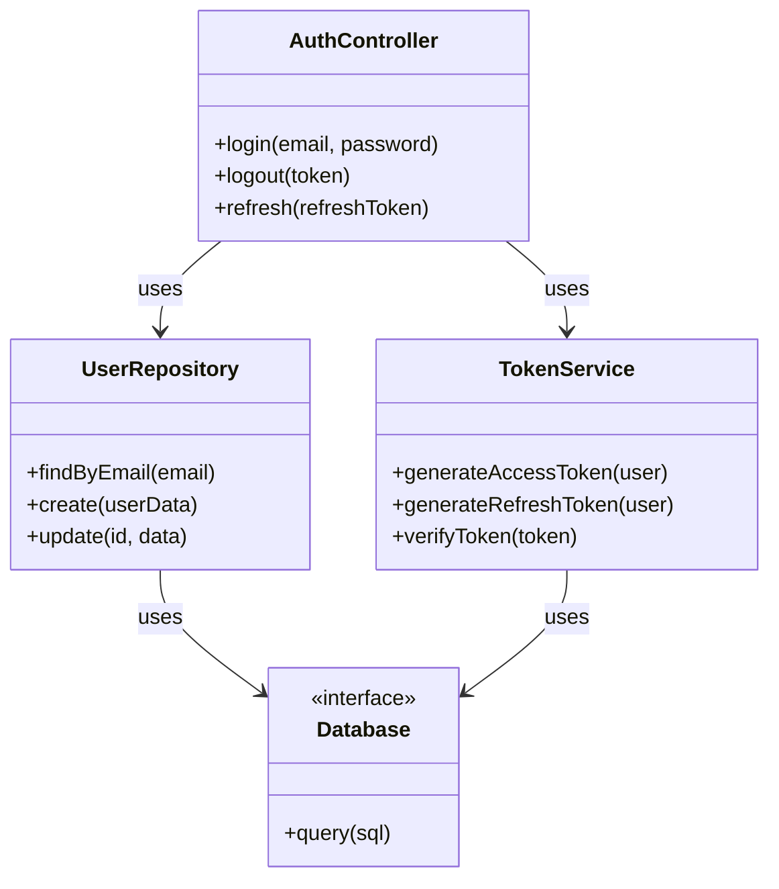
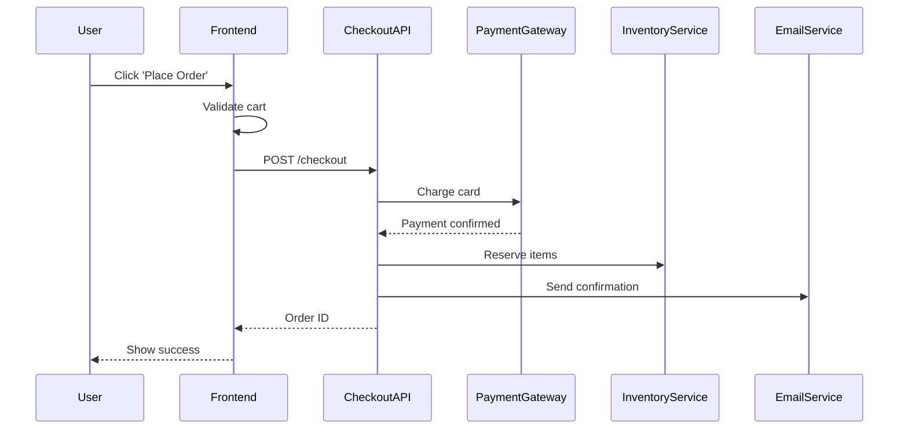

# Workflow Recipe: Legacy Code Analysis with Mermaid

**Time**: 10 minutes
**Difficulty**: Beginner
**Phase**: Phase 0.1 Discovery (new)
**Tools**: Claude Code, Mermaid.js

---

## When to Use

- ✅ New to unfamiliar codebase
- ✅ Need to understand architecture before making changes
- ✅ Reverse engineering existing system
- ✅ Onboarding new team members
- ✅ Creating technical documentation

**Real-world scenario**: "Inherited legacy Node.js API with 50+ files, no documentation"

---

## Step-by-Step Workflow

### Step 1: Scope the Analysis (2 min)

**What**: Define what part of codebase to analyze

```bash
# Option A: Analyze specific feature
Claude> "I want to understand the authentication system"

# Option B: Analyze by directory
Claude> "Analyze src/core/**/*.ts files"

# Option C: Analyze entire small project
Claude> "Analyze all files in src/"
```

**Expected outcome**: Clear scope defined (10-30 files recommended for first analysis)

**💡 Tip**: Start small (single feature) then expand

---

### Step 2: Generate Architecture Diagram (5 min)

**What**: Create visual Mermaid diagram showing relationships

**Method 1: Quick Analysis** (30 seconds) ⭐ **NEW**:
```bash
# Instant classDiagram generation (no text, pure code)
/analyze-code
```

**Method 2: Detailed Analysis** (5 minutes):
```bash
Claude> "Generate a Mermaid classDiagram for the authentication system showing:
1. All classes/modules
2. Dependencies between them
3. Key methods
4. Database entities involved

Format as valid Mermaid syntax I can copy-paste."
```

**Expected output**:
````markdown

````

**✅ Checkpoint**: Diagram renders correctly in Markdown preview

---

### Step 3: Save Documentation (3 min)

**What**: Persist diagram for team reference

```bash
# Create or update architecture doc
Claude> "Save this diagram to docs/architecture/auth-system.md with:
1. Title and purpose
2. The Mermaid diagram
3. Brief description of each component
4. Key dependencies and data flow"
```

**Expected file structure**:
```
docs/
└── architecture/
    ├── auth-system.md          # ✅ Created
    ├── payment-flow.md         # (future analyses)
    └── data-pipeline.md        # (future analyses)
```

**✅ Checkpoint**: Documentation saved and committed

---

## Output Example

**docs/architecture/auth-system.md**:
```markdown
# Authentication System Architecture

**Purpose**: User authentication and authorization flow

**Last Updated**: 2025-01-19

## System Diagram

```mermaid
classDiagram
    [... diagram from Step 2 ...]
```

## Components

### AuthController
- **Purpose**: HTTP endpoint handlers for auth operations
- **Key Methods**:
  - `login()`: Validates credentials, returns JWT
  - `logout()`: Invalidates refresh token
  - `refresh()`: Issues new access token

### UserRepository
- **Purpose**: Database operations for user data
- **Dependencies**: PostgreSQL database
- **Key Methods**:
  - `findByEmail()`: User lookup
  - `create()`: New user registration

### TokenService
- **Purpose**: JWT generation and validation
- **Dependencies**: Redis for token storage
- **Security**: Uses RS256 algorithm

## Data Flow

1. Client POST `/auth/login` → AuthController
2. AuthController → UserRepository (verify user)
3. AuthController → TokenService (generate tokens)
4. TokenService → Redis (store refresh token)
5. Response with access + refresh tokens
```

---

## Advanced Variations

### Variation 1: Sequence Diagram (User Flow)

For understanding request/response flow:
```bash
Claude> "Generate Mermaid sequenceDiagram for login flow showing:
- Client request
- API route
- Database queries
- Response"
```

### Variation 2: Database ER Diagram

For data model analysis:
```bash
Claude> "Generate Mermaid ER diagram for user/auth tables showing:
- Tables (users, sessions, tokens)
- Relationships
- Key fields"
```

### Variation 3: Module Dependency Graph

For monorepo or microservices:
```bash
Claude> "Generate dependency graph showing:
- All services/modules
- Inter-service communication
- Shared libraries"
```

---

## Integration with Phase System

This recipe is **Phase 0.1 Discovery** (proposed new phase):

**Phase Flow**:
```
Phase 0.1: Discovery (this recipe) → Phase 0: PRD → Phase 1: Implementation
```

**When to use**:
- **Before Phase 0**: When working with existing codebase
- **Standalone**: Quick understanding without full development cycle
- **Documentation**: Creating/updating architecture docs

---

## Related Commands

**Slash commands**:
- `/analyze-code` ⭐ **NEW** - Generate pure Mermaid classDiagram (30 sec, no text)
- `/doc-generate` - Create comprehensive documentation
- `/code-explain` - Explain specific code section

**Existing agents to use**:
- **context7-engineer** - Verify framework/library usage
- **seq-engineer** - Analyze complex sequences
- **architect-reviewer** - Validate architecture decisions

---

## Success Checklist

Before completing this recipe:
- [ ] Scope clearly defined (10-30 files)
- [ ] Mermaid diagram renders correctly
- [ ] All major components shown
- [ ] Dependencies/relationships accurate
- [ ] Documentation saved to `docs/architecture/`
- [ ] Diagram committed to git

---

## Real Example: E-commerce Checkout

**Scenario**: Need to understand checkout flow before adding discount codes feature

```bash
# Step 1: Scope (1min)
Claude> "Analyze checkout flow in src/checkout/ directory"

# Step 2: Generate Diagram (4min)
Claude> "Generate Mermaid sequenceDiagram showing:
1. User clicks 'Place Order'
2. Frontend validates cart
3. API processes payment
4. Inventory updated
5. Email confirmation sent"

# Output:


# Step 3: Save (3min)
Claude> "Save to docs/architecture/checkout-flow.md"
git add docs/architecture/checkout-flow.md
git commit -m "docs: Add checkout flow architecture diagram"
```

**Total time**: 8 minutes
**Understanding gained**: Complete checkout flow
**Documentation created**: ✅
**Ready for**: Phase 0 PRD (adding discount codes feature)

---

## Why This Works

**Mermaid Advantages**:
1. **Visual**: Easier to understand than reading code
2. **Versionable**: Text-based, works with git
3. **Shareable**: Renders in GitHub/GitLab/VS Code
4. **Maintainable**: Update diagram when code changes

**Time Comparison**:
- ❌ **Manual**: Read code (2h) + Draw diagram (1h) + Documentation (30min) = 3.5h
- ✅ **This Recipe**: Scope (2m) + Generate (5m) + Save (3m) = 10min (95% faster)

---

## Tips & Best Practices

### Tip 1: Start with High-Level, Then Drill Down

```bash
# First pass: High-level
Claude> "Show me all major modules and their relationships"

# Second pass: Drill into one module
Claude> "Now show detailed class diagram for UserService only"
```

### Tip 2: Use Consistent Naming

Standardize your architecture docs:
```
docs/architecture/
├── {feature}-system.md        # classDiagram
├── {feature}-flow.md          # sequenceDiagram
└── {feature}-data.md          # ER diagram
```

### Tip 3: Keep Diagrams Updated

When making changes:
```bash
# After implementing feature
Claude> "Update docs/architecture/auth-system.md to reflect new OAuth2 integration"
```

---

**Next Steps**:
- To implement based on this analysis → Use [recipe-new-feature.md](recipe-new-feature.md)
- For daily code exploration → Use [recipe-daily-routine.md](recipe-daily-routine.md)
- For fixing bugs found during analysis → Use [recipe-debugging-tdd.md](recipe-debugging-tdd.md)
